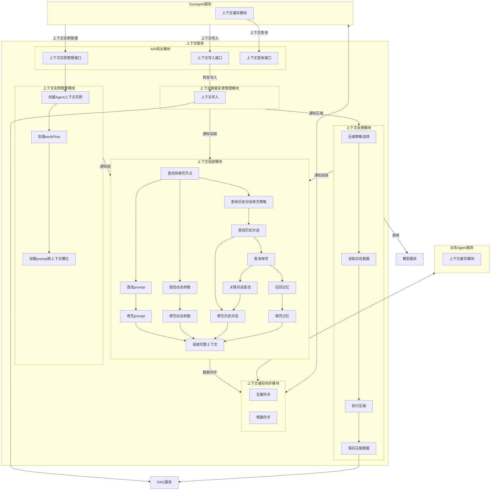
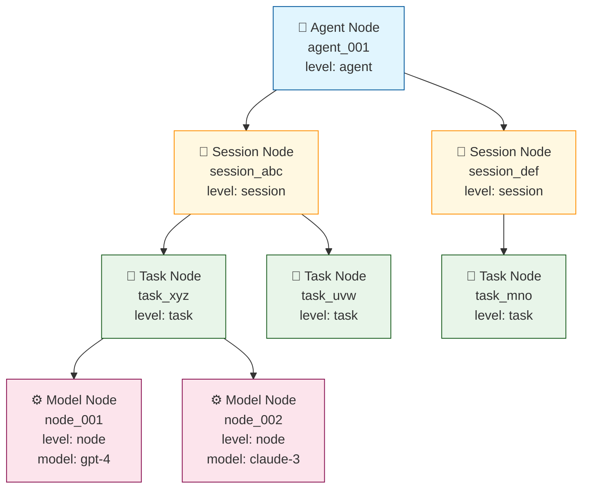

# 上下文服务设计文档

## 1. 概述

### 1.1 背景
上下文服务是 AI 系统的核心组件，负责管理 Agent 会话的上下文数据，包括上下文创建、存储、查询、压缩和同步等功能。

### 1.2 目标
- 提供统一的上下文管理能力，支持业务 Agent 和 SysAgent
- 实现高效的上下文缓存同步机制
- 支持上下文压缩，优化存储和传输
- 提供灵活的上下文组装能力

### 1.3 术语说明
| 术语 | 说明 |
|------|------|
| Agent | 智能体，包括业务 Agent 和 SysAgent |
| 上下文 | Agent 会话的历史记录、状态信息 |
| 上下文实例 | 特定 Agent 的上下文对象 |
| RAG | 检索增强生成服务（内置关系数据库） |

---

## 2. 架构设计

### 2.1 整体架构

```
┌─────────────────┐     ┌─────────────────┐
│  业务Agent服务   │     │   SysAgent服务   │
│  (上下文缓存)    │     │  (上下文缓存)    │
└────────┬────────┘     └────────┬────────┘
         │                       │
         │    ┌─────────────┐    │
         └────┤  上下文服务  ├────┘
              │  ContextSvc │
              └──────┬──────┘
                     │
                     ▼
            ┌─────────────────┐
            │   RAG服务        │
            │  (关系库+向量库)  │
            └─────────────────┘
```

### 2.2 模块划分

上下文服务包含以下核心模块：

| 模块 | 职责 |
|------|------|
| API网关模块 | 对外提供统一接口，包括实例管理、上下文写入、查询 |
| 上下文实例管理模块 | 管理 Agent 上下文实例的生命周期 |
| 上下文数据变更管理模块 | 处理上下文数据的变更和持久化 |
| 上下文处理模块 | 执行上下文压缩策略 |
| 上下文组装模块 | 组装完整上下文，供 LLM 使用 |
| 上下文缓存同步模块 | 与 Agent 端缓存进行双向同步 |

### 2.3 整体流程图



**流程说明**：

1. **SysAgent** 通过 API 网关调用上下文服务：
   - 调用「上下文实例管理接口」创建/更新/删除实例
   - 调用「上下文写入接口」写入会话数据

2. **上下文服务内部流转**：
   - 「上下文实例管理模块」创建实例后，通知「上下文组装模块」预装填
   - 「上下文数据变更管理模块」写入数据后，通知「上下文处理模块」压缩，同时通知「上下文组装模块」更新
   - 「上下文处理模块」压缩完成后，通知「上下文组装模块」重新组装
   - 「上下文组装模块」完成组装后，通过「上下文缓存同步模块」同步到 Agent

3. **外部依赖**：
   - **RAG服务**：用于数据持久化存储
   - **模型服务**：用于压缩时的摘要生成

4. **缓存同步**：
   - 「上下文缓存同步模块」与业务 Agent 和 SysAgent 进行双向全量/增量同步

---

## 3. 模块详细设计

### 3.1 API网关模块

**职责**：对外暴露统一的上下文服务接口，负责请求路由、协议转换、权限校验。

**接口列表**：

| 接口 | 功能 | 调用方 |
|------|------|--------|
| 上下文实例管理接口 | 创建/更新/删除上下文实例 | SysAgent |
| 上下文写入接口 | 写入会话数据 | SysAgent、业务Agent |
| 上下文查询接口 | 查询上下文数据 | SysAgent |

**数据流**：
```
SysAgent → 上下文写入接口 → 上下文数据变更管理模块 → RAG
```

**接口定义**：

**1. 创建上下文实例接口**

| 项目 | 说明 |
|------|------|
| **接口地址** | `POST /context/v1/instance/create` |
| **调用方** | SysAgent |
| **功能描述** | 创建新的上下文实例，初始化模型调用链和Prompt模板 |

**Request参数**：

| 参数名 | 类型 | 必填 | 说明 |
|--------|------|------|------|
| agent_id | string | 是 | Agent唯一标识 |
| session_id | string | 是 | 会话唯一标识 |
| task_id | string | 否 | 任务唯一标识，task级实例必填 |
| agenttype | string | 是 | Agent类型枚举：sys_agent, qa_agent, travel_agent, shopping_agent, movie_agent |

**Response参数**：

| 参数名 | 类型 | 说明 |
|--------|------|------|
| code | int | 状态码，0表示成功 |
| message | string | 状态描述 |
| data.instance_id | string | 实例唯一标识 |

**调用示例**：

```bash
curl -X POST http://localhost:8080/context/v1/instance/create \
  -H "Content-Type: application/json" \
  -H "X-API-Key: your-api-key" \
  -d '{
    "agent_id": "agent_001",
    "session_id": "session_abc123",
    "task_id": "task_xyz789",
    "agenttype": "qa_agent"
  }'
```

**响应示例**：

```json
{
  "code": 0,
  "message": "success",
  "data": {
    "instance_id": "inst_001"
  }
}
```

---

**2. 更新上下文实例接口**

| 项目 | 说明 |
|------|------|
| **接口地址** | `PUT /context/v1/instance/{instance_id}/update` |
| **调用方** | SysAgent |
| **功能描述** | 更新指定实例的参数和上下文数据 |

**Path参数**：

| 参数名 | 类型 | 说明 |
|--------|------|------|
| instance_id | string | 实例唯一标识 |

**Request参数**：

| 参数名 | 类型 | 必填 | 说明 |
|--------|------|------|------|
| params | object | 否 | 更新的参数值 |
| context_data | object | 否 | 更新的上下文数据 |

**Response参数**：

| 参数名 | 类型 | 说明 |
|--------|------|------|
| code | int | 状态码 |
| message | string | 状态描述 |
| data.instance_id | string | 实例唯一标识 |
| data.updated_at | string | 更新时间戳 |

**调用示例**：

```bash
curl -X PUT http://localhost:8080/context/v1/instance/inst_001/update \
  -H "Content-Type: application/json" \
  -H "X-API-Key: your-api-key" \
  -d '{
    "params": {
      "temperature": 0.8,
      "max_tokens": 2000
    },
    "context_data": {
      "user_preference": "concise"
    }
  }'
```

**响应示例**：

```json
{
  "code": 0,
  "message": "success",
  "data": {
    "instance_id": "inst_001",
    "updated_at": "2026-03-08T14:30:00Z"
  }
}
```

---

**3. 删除上下文实例接口**

| 项目 | 说明 |
|------|------|
| **接口地址** | `DELETE /context/v1/instance/{instance_id}` |
| **调用方** | SysAgent |
| **功能描述** | 删除指定上下文实例，释放资源 |

**Path参数**：

| 参数名 | 类型 | 说明 |
|--------|------|------|
| instance_id | string | 实例唯一标识 |

**Response参数**：

| 参数名 | 类型 | 说明 |
|--------|------|------|
| code | int | 状态码 |
| message | string | 状态描述 |

**调用示例**：

```bash
curl -X DELETE http://localhost:8080/context/v1/instance/inst_001 \
  -H "X-API-Key: your-api-key"
```

**响应示例**：

```json
{
  "code": 0,
  "message": "success"
}
```

---

**4. 上下文写入接口**

| 项目 | 说明 |
|------|------|
| **接口地址** | `POST /context/v1/write` |
| **调用方** | SysAgent、业务Agent |
| **功能描述** | 写入会话数据，触发后续处理和组装流程 |

**Request参数**：

| 参数名 | 类型 | 必填 | 说明 |
|--------|------|------|------|
| agent_id | string | 是 | Agent唯一标识 |
| session_id | string | 是 | 会话唯一标识 |
| task_id | string | 否 | 任务唯一标识 |
| messages | array | 否 | 对话消息列表 |
| tool_results | array | 否 | 工具调用结果列表 |
| dynamic_params | object | 否 | 动态参数键值对 |
| metadata | object | 否 | 元数据信息 |

**参数结构详情**：

```json
{
  "agent_id": "agent_001",
  "session_id": "session_abc123",
  "task_id": "task_xyz789",
  "messages": [
    {
      "role": "user",
      "content": "你好",
      "timestamp": "2026-03-08T10:00:00Z"
    },
    {
      "role": "assistant",
      "content": "您好！有什么可以帮助您的？",
      "timestamp": "2026-03-08T10:00:05Z"
    }
  ],
  "tool_results": [
    {
      "tool_id": "search_tool",
      "tool_name": "天气查询",
      "invocation_id": "inv_001",
      "status": "success",
      "input": {"city": "北京"},
      "output": {"temperature": 25, "weather": "晴"},
      "timestamp": "2026-03-08T10:00:10Z"
    }
  ],
  "dynamic_params": {
    "user_location": "北京",
    "preferred_language": "zh-CN"
  }
}
```

**Response参数**：

| 参数名 | 类型 | 说明 |
|--------|------|------|
| code | int | 状态码 |
| message | string | 状态描述 |
| data.context_id | string | 上下文数据标识 |

**调用示例**：

```bash
curl -X POST http://localhost:8080/context/v1/write \
  -H "Content-Type: application/json" \
  -H "X-API-Key: your-api-key" \
  -d '{
    "agent_id": "agent_001",
    "session_id": "session_abc123",
    "task_id": "task_xyz789",
    "messages": [
      {
        "role": "user",
        "content": "北京今天天气怎么样？",
        "timestamp": "2026-03-08T10:00:00Z"
      }
    ],
    "tool_results": [
      {
        "tool_id": "weather_query",
        "tool_name": "天气查询",
        "invocation_id": "inv_001",
        "status": "success",
        "input": {"city": "北京"},
        "output": {"temperature": 25, "weather": "晴", "humidity": 40},
        "timestamp": "2026-03-08T10:00:10Z"
      }
    ],
    "dynamic_params": {
      "user_location": "北京",
      "preferred_language": "zh-CN"
    },
    "metadata": {
      "source": "web",
      "version": "1.0"
    }
  }'
```

**响应示例**：

```json
{
  "code": 0,
  "message": "success",
  "data": {
    "context_id": "ctx_001"
  }
}
```

---

**5. 上下文查询接口**

| 项目 | 说明 |
|------|------|
| **接口地址** | `GET /context/v1/query` |
| **调用方** | SysAgent |
| **功能描述** | 查询指定Agent/Session的上下文数据 |

**Query参数**：

| 参数名 | 类型 | 必填 | 说明 |
|--------|------|------|------|
| agent_id | string | 是 | Agent唯一标识 |
| session_id | string | 是 | 会话唯一标识 |
| task_id | string | 否 | 任务唯一标识 |

**Response参数**：

| 参数名 | 类型 | 说明 |
|--------|------|------|
| code | int | 状态码 |
| message | string | 状态描述 |
| data.context.instance_id | string | 实例标识 |
| data.context.messages | array | 消息列表 |
| data.context.parameters | object | 参数值 |

**调用示例**：

```bash
curl -X GET "http://localhost:8080/context/v1/query?agent_id=agent_001&session_id=session_abc123&task_id=task_xyz789" \
  -H "X-API-Key: your-api-key"
```

**响应示例**：

```json
{
  "code": 0,
  "message": "success",
  "data": {
    "context": {
      "instance_id": "inst_001",
      "agent_id": "agent_001",
      "session_id": "session_abc123",
      "task_id": "task_xyz789",
      "messages": [
        {
          "role": "user",
          "content": "北京今天天气怎么样？",
          "timestamp": "2026-03-08T10:00:00Z"
        },
        {
          "role": "assistant",
          "content": "北京今天天气晴朗，气温25度。",
          "timestamp": "2026-03-08T10:00:15Z"
        }
      ],
      "parameters": {
        "temperature": 0.7,
        "max_tokens": 2000
      }
    }
  }
}
```

---

### 3.2 上下文实例管理模块

**职责**：管理上下文实例的创建、初始化、销毁。系统启动时预加载所有Agent配置，实例创建时快速绑定预置配置。

**预置配置说明**：

系统首次启动时会从配置中心加载并缓存以下预置数据：

| 预置数据 | 内容说明 | 配置时机 |
|----------|----------|----------|
| **工作流配置** | Agent类型的标准执行流程、步骤依赖关系 | 系统启动时 |
| **模型编排节点** | 模型调用顺序、策略、fallback配置、超时重试参数 | 系统启动时 |
| **Prompt模板** | System Prompt、User Prompt、Model Specific Prompts | 系统启动时 |
| **槽位参数定义** | 输入参数、动态参数、输出参数的定义和校验规则 | 系统启动时 |


**核心流程**：

```
接收请求 → 解析验证 → 绑定预置配置 → 构建实例 → 通知下游
```

**详细流程**：

```
接收请求 → 解析验证 → 加载预置配置 → 构建实例 → 持久化存储 → 通知下游
```

#### 步骤1：接收请求
- 接收实例创建/更新/删除请求
- 请求参数：
  | 参数名 | 类型 | 必填 | 说明 |
  |--------|------|------|------|
  | agent_id | string | 是 | Agent唯一标识 |
  | session_id | string | 是 | 会话唯一标识 |
  | task_id | string | 否 | 任务唯一标识（task级实例必填）|
  | agenttype | string | 是 | Agent类型枚举：sys_agent, qa_agent, travel_agent, shopping_agent, movie_agent |

#### 步骤2：解析验证
- 解析请求参数，提取 agent_id、session_id、task_id、agenttype
- 验证 agenttype 对应的预置配置是否已加载（从配置库中查询）
- 校验调用方权限（API Key 验证）
- 若 task_id 为空，创建 session 级实例；否则创建 task 级实例

#### 步骤3：加载预置配置
从配置存储加载以下配置：

| 配置项 | 存储位置 | 说明 |
|--------|----------|------|
| 模型编排配置 | `agent_config.model_orchestration` | 模型调用链配置、路由规则 |
| Prompt模板库 | `agent_config.prompt_templates` | System Prompt、User Prompt、Model Specific Prompts |
| 参数定义 | `agent_config.parameters` | 输入参数、动态参数、输出参数定义 |
| WorkFlow配置 | `agent_config.workflow` | 工作流步骤、依赖关系 |
| 上下文槽位定义 | `agent_config.context_slots` | session、memory、tool 槽位配置 |

#### 步骤4：构建实例
创建上下文实例对象并初始化各组件：

**4.1 创建基础实例信息**
- 生成 instance_id（UUID格式）
- 设置 level 字段：agent/session/task/node
- 绑定业务标识：agent_id、session_id、task_id

**4.2 初始化模型调用链状态**
```json
{
  "model_chain": {
    "current_model_index": 0,
    "models": [
      {
        "order": 1,
        "model_id": "gpt-4",
        "status": "pending",
        "invocation_count": 0,
        "last_invoked_at": null
      }
    ]
  }
}
```

**4.3 应用Prompt模板**
- **System Prompt**：使用预置动态参数即时渲染，存储到 `system_prompt` 字段
- **User Prompt**：保持模板形式，存储到 `user_prompt` 字段，等待用户输入后渲染
- **Model Specific Prompts**：绑定到对应模型节点配置中

**4.4 实例化参数槽位**
```json
{
  "parameter_values": {
    "input": {},      // 验证必填项，设置默认值
    "dynamic": {},    // 标记数据源（配置库、知识库、上下文）
    "output": {}      // 预留结果存储位置
  }
}
```

**4.5 加载上下文槽位定义**
```json
{
  "context_slots": {
    "session_context": {"status": "empty", "data": {}, "token_count": 0},
    "memory_context": {"status": "empty", "data": {}, "retrieved_memories": []},
    "tool_context": {"status": "empty", "data": {}}
  }
}
```

#### 步骤5：持久化存储
将实例数据写入 RAG 服务的 `context_instance` 表：

| 表字段 | 填充值 |
|--------|--------|
| id | 生成的 instance_id |
| level | agent/session/task/node |
| agenttype | 请求中的 agenttype |
| agent_id | 请求中的 agent_id |
| session_id | 请求中的 session_id |
| task_id | 请求中的 task_id（如有）|
| status | active |
| system_prompt | 渲染后的 System Prompt |
| user_prompt | User Prompt 模板 |
| dynamic_params | 动态参数JSON |
| model_config | 模型配置JSON |
| created_at | 当前时间戳 |
| updated_at | 当前时间戳 |

#### 步骤6：通知下游
- **通知上下文组装模块**：触发预装填流程（加载session上下文、召回记忆）
- **通知缓存模块**：初始化分布式缓存（Redis）和本地缓存

**数据模型**：

**AgentConfig（完整Agent配置模型）**

```json
{
  "agenttype": "qa_agent",
  "version": "1.0",

  "workflow": {
    "workflow_id": "wf_qa_v1",
    "name": "问答Agent工作流",
    "description": "标准问答流程：意图识别 -> 答案生成",

    "nodes": [
      {
        "node_id": "intent_recognition",
        "node_type": "model",
        "name": "意图识别",
        "description": "分析用户query，识别意图和槽位",
        "order": 1,

        "context_requirements": {
          "required_slots": [
            {
              "slot_id": "user_original_query",
              "slot_type": "input",
              "description": "用户原始query",
              "fill_strategy": "direct_input",
              "data_type": "string",
              "required": true
            },
            {
              "slot_id": "user_rewritten_query",
              "slot_type": "dynamic",
              "description": "改写后的query",
              "fill_strategy": "preprocess",
              "depends_on": ["user_original_query"],
              "data_type": "string",
              "required": false
            }
          ],
          "history_messages": {
            "enabled": true,
            "max_turns": 3,
            "max_tokens": 3000,
            "filter_strategy": "relevance",
            "relevance_threshold": 0.7
          },
          "memory_context": {
            "enabled": false
          }
        },

        "input_mapping": {
          "query": "{{user_rewritten_query}}",
          "history_messages": "{{history_messages}}"
        },

        "output_mapping": {
          "intent": "output.intent",
          "slots": "output.slots",
          "confidence": "output.confidence"
        },

        "next_nodes": {
          "default": "answer_generation"
        }
      },
      {
        "node_id": "answer_generation",
        "node_type": "model",
        "name": "答案生成",
        "description": "基于上下文生成最终答案",
        "order": 2,
        "dependencies": ["intent_recognition"],


        "context_requirements": {
          "required_slots": [
            {
              "slot_id": "user_original_query",
              "slot_type": "input",
              "description": "展示给用户看的问题",
              "data_type": "string",
              "required": true
            },
            {
              "slot_id": "intent",
              "slot_type": "upstream_output",
              "source_node": "intent_recognition",
              "source_field": "intent",
              "data_type": "string",
              "required": true
            }
          ],
          "history_messages": {
            "enabled": true,
            "max_turns": 5,
            "filter_strategy": "sequential"
          },
          "memory_context": {
            "enabled": true,
            "retrieval_count": 2,
            "semantic_search": true
          }
        },

        "input_mapping": {
          "question": "{{user_original_query}}",
          "intent": "{{intent}}",
          "history": "{{history_messages}}",
          "memories": "{{memory_context}}"
        },

        "output_mapping": {
          "answer": "output.content",
          "citations": "output.citations",
          "confidence": "output.confidence"
        },

        "next_nodes": {
          "default": null
        }
      }
    ],

    "global_context": {
      "available_slots": [
        {
          "slot_id": "user_original_query",
          "slot_type": "input",
          "data_type": "string",
          "required": true,
          "description": "用户输入的原始query"
        },
        {
          "slot_id": "user_rewritten_query",
          "slot_type": "dynamic",
          "data_type": "string",
          "required": false,
          "default_value": null,
          "description": "改写优化后的query"
        },
        {
          "slot_id": "session_id",
          "slot_type": "meta",
          "data_type": "string",
          "required": true,
          "description": "会话唯一标识"
        },
        {
          "slot_id": "user_id",
          "slot_type": "meta",
          "data_type": "string",
          "required": false,
          "description": "用户唯一标识"
        }
      ],

    "error_handling": {
      "on_node_failure": {
        "strategy": "fallback",
        "fallback_node": null,
        "max_failures": 3
      },
      "on_timeout": {
        "strategy": "retry",
        "max_retries": 2
      }
    }
  }
}
```

**配置模型说明**

| 配置项 | 说明 |
|--------|------|
| `agenttype` | Agent类型标识，如 qa_agent、travel_agent |
| `version` | 配置版本号，用于配置更新管理 |
| `workflow` | 工作流定义，包含节点列表、全局上下文、错误处理 |
| `workflow.nodes` | 节点配置列表，每个节点包含模型配置、上下文需求、路由规则 |
| `workflow.global_context` | 全局槽位定义和可见性策略 |
| `workflow.error_handling` | 节点失败和超时时的处理策略 |


**ContextRequirement说明**

上下文需求配置定义了节点执行所需的上下文数据：
- `required_slots`：必需槽位列表，包含输入参数、动态参数、上游节点输出
- `history_messages`：历史对话消息配置（轮数、过滤策略）
- `session_context`：会话级上下文字段
- `memory_context`：记忆召回配置

**Slot类型说明**

| 类型 | 来源 | 说明 |
|------|------|------|
| `input` | 用户输入 | 直接从请求中获取的参数 |
| `dynamic` | 预处理 | 通过预处理逻辑生成的参数 |
| `upstream_output` | 上游节点 | 依赖节点的输出结果 |
| `meta` | 元数据 | 会话ID、用户ID等元信息 |


**数据存储设计**

上下文实例数据采用单表扁平化设计存储在 RAG 服务的关系数据库中。

### 单表设计

通过 `level` 字段区分四级层级，通过 `parent_id` 建立树形关系。

```sql
-- =============================================
-- 上下文实例统一表（存储在RAG服务的关系库中）
-- 存储 Agent → Session → Task → Model Node 四级层级数据
-- =============================================
CREATE TABLE context_instance (
    -- 主键和层级标识
    id                  VARCHAR(64) PRIMARY KEY COMMENT '节点唯一标识',
    level               VARCHAR(16) NOT NULL COMMENT '层级: agent/session/task/node',
    agenttype           VARCHAR(32) COMMENT 'Agent类型（仅agent层级）',

    -- 各层级的业务标识
    agent_id            VARCHAR(64) COMMENT '所属Agent ID',
    session_id          VARCHAR(64) COMMENT '所属Session ID',
    task_id             VARCHAR(64) COMMENT '所属Task ID',
    node_order          INT COMMENT '执行顺序（仅node层级）',

    -- 通用状态
    status              VARCHAR(16) DEFAULT 'active' COMMENT '状态',

    -- ===== Agent层级字段 =====
    current_session_id  VARCHAR(64) COMMENT '当前活跃会话ID（仅agent层级）',

    -- ===== Session层级字段 =====
    session_name        VARCHAR(256) COMMENT '会话名称（仅session层级）',

    -- ===== Task层级字段 =====
    task_type           VARCHAR(32) COMMENT '任务类型（仅task层级）',
    task_name           VARCHAR(256) COMMENT '任务名称（仅task层级）',

    -- ===== Model Node层级字段 =====
    node_type           VARCHAR(32) DEFAULT 'llm' COMMENT '节点类型（仅node层级）',
    model_id            VARCHAR(32) COMMENT '模型ID（仅node层级）',
    model_config        JSON COMMENT '模型配置（仅node层级）',

    -- Token消耗
    total_tokens        INT DEFAULT 0 COMMENT '总Token数',

    -- ===== 上下文内容（仅node层级） =====
    system_prompt       TEXT COMMENT '系统提示词',
    user_prompt         TEXT COMMENT '用户提示词',
    user_message        TEXT COMMENT '用户原始消息',
    user_original_query TEXT COMMENT '用户原始query',
    user_rewritten_query TEXT COMMENT '用户改写后query',
    input_messages      JSON COMMENT '输入消息列表',
    tool_results        JSON COMMENT '工具调用结果',
    dynamic_params      JSON COMMENT '动态参数值',


    -- 时间戳
    created_at          TIMESTAMP DEFAULT CURRENT_TIMESTAMP,
    updated_at          TIMESTAMP DEFAULT CURRENT_TIMESTAMP ON UPDATE CURRENT_TIMESTAMP,
    started_at          TIMESTAMP COMMENT '开始执行时间',
    completed_at        TIMESTAMP COMMENT '完成时间',

    -- 索引
    INDEX idx_level (level),
    INDEX idx_agent_id (agent_id),
    INDEX idx_session_id (session_id),
    INDEX idx_task_id (task_id),
    INDEX idx_model_id (model_id),
    INDEX idx_agenttype (agenttype),
    INDEX idx_status (status),
    INDEX idx_created_at (created_at),
    INDEX idx_level_agent (level, agent_id),
    INDEX idx_level_session (level, session_id),
    INDEX idx_level_task (level, task_id),
    INDEX idx_level_model (level, model_id)
) COMMENT='上下文实例统一表';
```

### 层级关系示例

| id | level | parent_id | root_id | path | 说明 |
|----|-------|-----------|---------|------|------|
| agent_001 | agent | null | agent_001 | agent_001 | Agent根节点 |
| session_abc | session | agent_001 | agent_001 | agent_001/session_abc | Session节点 |
| task_xyz | task | session_abc | agent_001 | agent_001/session_abc/task_xyz | Task节点 |
| node_001 | node | task_xyz | agent_001 | agent_001/session_abc/task_xyz/node_001 | Model Node |

### 树形结构可视化



### 存储策略

| 功能 | 实现方式 | 说明 |
|------|----------|------|
| 关系查询 | RAG内置关系数据库 | 通过 `level` + `parent_id` 查询层级 |

**查询示例**：

```sql
-- 查询Agent下的所有Session
SELECT * FROM context_instance
WHERE level = 'session' AND parent_id = 'agent_001';

-- 查询Session下的所有Task
SELECT * FROM context_instance
WHERE level = 'task' AND session_id = 'session_abc';

-- 查询Task下的所有Node，按执行顺序排序
SELECT * FROM context_instance
WHERE level = 'node' AND task_id = 'task_xyz'
ORDER BY node_order;
```

---

### 3.3 上下文数据变更管理模块

**职责**：接收并处理上下文数据的变更请求，触发后续处理流程。

**核心功能**：
- 接收上下文写入请求
- 数据格式校验
- 写入数据到 RAG 服务进行持久化
- 通知上下文处理模块进行压缩
- 通知上下文组装模块更新数据

**详细流程**：

```
接收写入请求 → 数据格式校验 → 数据分类处理 → 持久化到RAG → 触发后续处理
```

#### 步骤1：接收写入请求
接收来自 API 网关的上下文写入请求，请求参数包括：

| 参数名 | 类型 | 必填 | 存储字段 |
|--------|------|------|----------|
| agent_id | string | 是 | agent_id |
| session_id | string | 是 | session_id |
| task_id | string | 否 | task_id |
| messages | array | 否 | input_messages |
| tool_results | array | 否 | tool_results |
| dynamic_params | object | 否 | dynamic_params |
| metadata | object | 否 | 用于路由判断 |

#### 步骤2：数据格式校验
- 验证必填字段：agent_id、session_id
- 验证 messages 格式（role、content、timestamp）
- 验证 tool_results 格式（tool_id、status、input、output）
- 验证 agenttype 合法性（sys_agent, qa_agent, travel_agent, shopping_agent, movie_agent）

#### 步骤3：数据分类处理
根据数据类型决定存储策略：

| 数据类型 | 处理逻辑 | 目标表字段 |
|----------|----------|------------|
| 用户消息 | 提取 user_original_query | user_original_query, user_message |
| 助手回复 | 更新对话历史 | input_messages（追加）|
| 工具结果 | 结构化存储 | tool_results（追加）|
| 动态参数 | 合并更新 | dynamic_params（合并）|
| 改写Query | 存储改写后Query | user_rewritten_query |

#### 步骤4：持久化到RAG
根据 instance_id 查询已有记录，执行更新操作：

```sql
-- 更新 Node 层级实例的上下文数据
UPDATE context_instance
SET
    input_messages = JSON_MERGE_PATCH(input_messages, ?),
    tool_results = JSON_MERGE_PATCH(tool_results, ?),
    dynamic_params = JSON_MERGE_PATCH(dynamic_params, ?),
    user_message = ?,
    user_original_query = ?,
    user_rewritten_query = ?,
    updated_at = CURRENT_TIMESTAMP
WHERE id = ? AND level = 'node';
```

#### 步骤5：触发后续处理
- **触发压缩流程**：当消息数量超过阈值（如10条）或Token数超过限制时，通知上下文处理模块
- **触发组装流程**：数据更新完成后，通知上下文组装模块重新组装上下文
- **记录变更日志**：写入变更历史，用于增量同步

**数据变更事件类型**：

| 事件类型 | 触发条件 | 后续动作 |
|----------|----------|----------|
| MESSAGE_ADDED | 新增对话消息 | 通知组装模块 |
| TOOL_RESULT_ADDED | 新增工具结果 | 通知组装模块 |
| PARAMS_UPDATED | 动态参数变更 | 通知组装模块 |
| COMPRESSION_NEEDED | Token超限 | 通知处理模块压缩 |
| NODE_COMPLETED | 模型节点完成 | 触发下游节点 |

---

### 3.4 上下文处理模块

**职责**：对上下文数据进行压缩处理，优化存储空间和传输效率。

**处理流程**：

```
接收压缩通知 → 压缩策略选择 → 读取对话数据 → 执行压缩 → 保存压缩数据 → 通知组装
```

#### 步骤1：接收压缩通知
接收来自数据变更管理模块的压缩请求，包含：
- instance_id：需要压缩的实例ID
- compression_trigger：触发原因（token_limit / message_count / manual）
- target_node_ids：需要压缩的节点列表

#### 步骤2：压缩策略选择
根据 `context_instance.model_config` 中的配置选择压缩策略：

| 策略 | 适用场景 | 配置来源 |
|------|----------|----------|
| **摘要生成** | 长对话历史 | `workflow.nodes[].context_requirements.history_messages.max_tokens` |
| **历史截断** | Token超限 | `workflow.nodes[].context_requirements.history_messages.max_turns` |
| **向量化存储** | 需要语义检索 | memory_context 配置 |
| **关键信息提取** | 工具结果过多 | 节点配置的 output_mapping |

#### 步骤3：读取对话数据
从 RAG 服务查询待压缩数据：

```sql
-- 查询节点的完整上下文数据
SELECT
    input_messages,
    tool_results,
    dynamic_params,
    user_original_query,
    user_rewritten_query,
    model_config->>'$.context_requirements' as ctx_requirements
FROM context_instance
WHERE id = ? AND level = 'node';
```

#### 步骤4：执行压缩
根据选择的策略执行压缩：

**4.1 摘要生成压缩**
- 调用 LLM 服务生成对话摘要
- 输入：原始对话消息列表
- 输出：摘要文本 + 关键信息提取

**4.2 历史截断**
- 保留最近 N 轮对话（根据 `max_turns` 配置）
- 早期对话存入归档表（如有需要）

**4.3 工具结果精简**
- 保留工具调用关键字段（tool_id、status、关键output）
- 移除详细输出中的冗余信息

#### 步骤5：保存压缩数据
将压缩后的数据更新到数据库：

```sql
UPDATE context_instance
SET
    input_messages = ?,           -- 压缩后的消息列表
    tool_results = ?,             -- 精简后的工具结果
    total_tokens = ?,             -- 更新Token计数
    updated_at = CURRENT_TIMESTAMP
WHERE id = ?;
```

#### 步骤6：通知组装模块
- 发送压缩完成通知给上下文组装模块
- 携带压缩摘要信息，便于组装时选择使用原始数据还是压缩数据

**压缩触发条件**：

| 条件 | 阈值来源 | 检查时机 |
|------|----------|----------|
| Token数超限 | `model_config.max_tokens` | 每次写入后 |
| 消息数超限 | `history_messages.max_turns` | 每次写入后 |
| 会话结束时 | 节点状态变为 completed | 节点完成时 |
| 手动触发 | API调用 | 按需 |

---

### 3.5 上下文组装模块

**职责**：根据 LLM 的需求，组装完整的上下文数据。

**组装流程**：

```
接收组装通知 → 确定待填充节点 → 并行获取各组件 → 填充组件 → 组装完整上下文 → 同步缓存
```

#### 步骤1：接收组装通知
接收来自实例管理模块或数据变更模块的组装请求：
- instance_id：需要组装的实例ID
- node_id：当前执行的模型节点ID
- assembly_type：组装类型（pre_fill / incremental / full）

#### 步骤2：确定待填充节点
根据 instance_id 和 node_id 查询节点配置：

```sql
-- 查询节点配置和上下文需求
SELECT
    model_config->>'$.context_requirements' as ctx_requirements,
    model_config->>'$.input_mapping' as input_mapping,
    system_prompt,
    user_prompt,
    dynamic_params
FROM context_instance
WHERE id = ? AND level = 'node';
```

解析 `context_requirements` 获取需要填充的槽位列表：
- required_slots：必需槽位（输入参数、动态参数、上游输出）
- history_messages：历史对话配置
- memory_context：记忆召回配置

#### 步骤3：并行获取各组件

**3.1 获取Prompt**
- System Prompt：直接从 `context_instance.system_prompt` 读取
- User Prompt：从 `context_instance.user_prompt` 读取模板，等待渲染

**3.2 获取动态参数**
从 `context_instance.dynamic_params` 读取已存储的动态参数值

**3.3 查询历史对话**
根据 `history_messages` 配置查询：

```sql
-- 查询指定Session的历史消息
SELECT input_messages
FROM context_instance
WHERE level = 'node'
  AND session_id = ?
  AND created_at > DATE_SUB(NOW(), INTERVAL ? HOUR)
ORDER BY created_at DESC
LIMIT ?;
```

**3.4 召回记忆（可选）**
若 `memory_context.enabled = true`：
- 使用 `user_rewritten_query` 或 `user_original_query` 作为查询向量
- 调用RAG向量检索，获取相关记忆
- 限制数量：`memory_context.retrieval_count`

#### 步骤4：填充组件

**4.1 渲染Prompt**
- System Prompt：已预渲染，直接使用
- User Prompt：使用动态参数和当前用户输入进行模板渲染

**4.2 填充历史对话**
根据填充策略处理历史消息：

| 策略 | 说明 | 配置来源 |
|------|------|----------|
| sequential | 按时间顺序取最近N轮 | `filter_strategy: sequential` |
| relevance | 按语义相关度筛选 | `filter_strategy: relevance` |
| summary | 使用摘要替代早期对话 | 压缩模块输出 |

**4.3 填充记忆**
将召回的记忆按相关度排序，格式化为记忆上下文块

#### 步骤5：组装完整上下文
按照LLM要求的格式组装最终上下文：

```json
{
  "model_id": "gpt-4",
  "messages": [
    {"role": "system", "content": "{{system_prompt}}"},
    {"role": "user", "content": "{{user_prompt}}"},
    {"role": "assistant", "content": "...", "context_type": "history"},
    {"role": "user", "content": "...", "context_type": "current"}
  ],
  "context_metadata": {
    "session_id": "...",
    "memory_count": 3,
    "history_turns": 5,
    "total_tokens": 2500
  }
}
```

#### 步骤6：同步缓存
将组装完成的上下文发送给缓存同步模块，更新Agent端缓存。

**组装触发时机**：

| 触发源 | 触发条件 | 组装类型 |
|--------|----------|----------|
| 实例管理模块 | 实例创建完成 | pre_fill |
| 数据变更模块 | 新消息写入 | incremental |
| 处理模块 | 压缩完成 | full |
| 模型调用前 | 需要完整上下文 | full |

---

### 3.6 上下文缓存同步模块

**职责**：实现上下文服务与 Agent 端缓存的双向同步。

**同步模式**：
- **全量同步**：初次连接或缓存失效时，同步全部上下文数据
- **增量同步**：日常更新时，仅同步变更部分
- **删除同步**：实例删除时，清理相关缓存

**同步流程**：

```
接收同步请求 → 解析同步类型 → 数据版本校验 → 获取数据 → 合并数据 → 更新缓存 → 推送通知
```

#### 步骤1：接收同步请求
接收来自以下源的同步请求：

| 来源 | 请求类型 | 说明 |
|------|----------|------|
| Agent服务 | 全量/增量同步请求 | Agent启动或定时同步 |
| 上下文组装模块 | 增量推送 | 上下文组装完成 |
| 上下文处理模块 | 压缩更新推送 | 压缩完成后 |
| 实例管理模块 | 删除通知 | 实例删除时 |

#### 步骤2：解析同步类型
根据请求参数确定同步策略：

| 同步类型 | 判断条件 | 处理方式 |
|----------|----------|----------|
| 全量同步 | version=0 或 cache_miss | 读取完整实例数据 |
| 增量同步 | version>0 且 last_sync 存在 | 读取变更日志 |
| 删除同步 | action=delete | 清理缓存数据 |

#### 步骤3：数据版本校验
```sql
-- 查询实例最新版本信息
SELECT
    id,
    updated_at,
    status,
    input_messages,
    dynamic_params
FROM context_instance
WHERE id = ?;
```

- 比较请求中的版本号与数据库最新版本
- 若数据库版本较新，执行同步
- 若Agent版本较新，接收Agent推送的更新

#### 步骤4：获取数据

**4.1 全量同步数据获取**
```sql
-- 查询实例完整数据
SELECT *
FROM context_instance
WHERE agent_id = ? AND session_id = ? AND status = 'active';
```

**4.2 增量同步数据获取**
```sql
-- 查询变更日志（假设存在变更日志表）
SELECT *
FROM context_change_log
WHERE instance_id = ? AND created_at > ?
ORDER BY created_at ASC;
```

#### 步骤5：合并数据

**5.1 Agent数据合并到服务端**
- 接收Agent推送的本地缓存更新
- 合并到数据库：使用 JSON_MERGE_PATCH 合并动态参数
- 解决冲突：以服务端数据为准，或根据时间戳判断

**5.2 服务端数据合并到Agent**
- 将数据库查询结果格式化为缓存对象
- 应用增量补丁（增量同步时）

#### 步骤6：更新缓存

**6.1 更新本地缓存（内存）**
- 更新上下文服务内存中的缓存数据
- 设置过期时间（TTL）

**6.2 更新分布式缓存（Redis）**
```
Key: context:{instance_id}
Value: 序列化的上下文数据
TTL: 3600秒
```

**6.3 更新Agent缓存**
- 通过API响应返回更新数据
- 或推送Webhook通知Agent拉取更新

#### 步骤7：推送通知

| 通知类型 | 目标 | 内容 |
|----------|------|------|
| 全量更新 | Agent | 完整上下文JSON |
| 增量补丁 | Agent | 变更字段Patch |
| 删除通知 | Agent | instance_id列表 |
| 广播变更 | 所有相关Agent | 版本号更新通知 |

**同步触发时机**：

| 触发场景 | 同步类型 | 延迟要求 |
|----------|----------|----------|
| Agent启动 | 全量 | 实时 |
| 定时心跳 | 增量 | 5秒间隔 |
| 上下文写入 | 增量推送 | 实时 |
| 压缩完成 | 增量推送 | 实时 |
| 实例删除 | 删除同步 | 实时 |

**缓存存储结构**：

```json
{
  "cache_key": "context:inst_xxx",
  "data": {
    "instance_id": "inst_xxx",
    "agent_id": "agent_001",
    "session_id": "session_abc",
    "status": "active",
    "messages": [...],
    "parameters": {...},
    "assembled_context": {...}
  },
  "metadata": {
    "version": 12,
    "last_sync_at": "2026-03-08T15:30:00Z",
    "ttl": 3600
  }
}
```

---

## 4. 数据流设计

### 4.1 上下文写入流程

```
SysAgent
    │
    ▼
上下文写入接口(API网关)
    │
    ▼
上下文数据变更管理模块
    │
    ├───► RAG服务(持久化)
    │
    ├───► 通知压缩 ──► 上下文处理模块
    │
    └───► 通知组装 ──► 上下文组装模块
```

### 4.2 上下文查询流程

```
SysAgent
    │
    ▼
上下文查询接口(API网关)
    │
    ▼
上下文缓存同步模块
    │
    ├───► 从RAG查询上下文数据
    │
    └───► 返回数据 ──► SysAgent
```

### 4.3 上下文组装流程

```
上下文实例管理模块 ──► 通知预装填
                              │
                              ▼
                     上下文组装模块
                              │
        ┌─────────────────────┼─────────────────────┐
        ▼                     ▼                     ▼
   查找prompt           查找动态参数         查询历史对话
        │                     │                     │
        ▼                     ▼                     ▼
   填充prompt           填充动态参数      查询改写/关联查找
        │                     │                     │
        │                     │                     ▼
        │                     │               召回记忆/填充记忆
        │                     │                     │
        └─────────────────────┴─────────────────────┘
                              │
                              ▼
                    组装完整上下文
                              │
                              ▼
                    上下文缓存同步模块
```

### 4.4 模块间交互关系

| 源模块 | 目标模块 | 交互内容 |
|--------|----------|----------|
| 上下文实例管理模块 | 上下文组装模块 | 通知预装填 |
| 上下文数据变更管理模块 | 上下文处理模块 | 通知压缩 |
| 上下文数据变更管理模块 | 上下文组装模块 | 通知组装 |
| 上下文处理模块 | 上下文组装模块 | 通知组装 |
| 上下文组装模块 | 上下文缓存同步模块 | 数据同步 |

---

## 5. 外部依赖

### 5.1 LLM 模型服务
- **用途**：上下文处理模块调用 LLM 进行智能压缩（摘要生成）
- **调用方式**：异步调用
- **数据格式**：JSON

### 5.2 RAG 检索服务
- **用途**：上下文数据的持久化存储和检索
- **写入方**：上下文数据变更管理模块、上下文处理模块
- **数据类型**：原始对话数据、压缩后数据、向量表示

---

## 6. 部署架构

```
┌─────────────────────────────────────────┐
│              业务Agent集群               │
│  ┌─────────┐ ┌─────────┐ ┌─────────┐   │
│  │ Agent-1 │ │ Agent-2 │ │ Agent-N │   │
│  └────┬────┘ └────┬────┘ └────┬────┘   │
└───────┼───────────┼───────────┼────────┘
        │           │           │
        └───────────┼───────────┘
                    │
┌───────────────────┼───────────────────┐
│              上下文服务集群            │
│  ┌─────────────────────────────────┐  │
│  │  API网关模块（多实例负载均衡）    │  │
│  └──────────────────┬──────────────┘  │
│                     │                  │
│  ┌──────────────────┼──────────────┐  │
│  │  上下文实例管理   │  上下文组装   │  │
│  │  上下文数据变更   │  上下文处理   │  │
│  │  上下文缓存同步   │              │  │
│  └──────────────────┴──────────────┘  │
└───────────────────────────────────────┘
                    │
        ┌───────────┴───────────┐
        ▼                       ▼
┌───────────────┐       ┌───────────────┐
│   RAG服务集群  │       │   LLM服务     │
└───────────────┘       └───────────────┘
```

---

## 7. 数据存储设计

### 7.1 存储方案

所有数据统一存储在 **RAG服务** 中，利用其内置的关系数据库能力。

```
┌─────────────────────────────────────────┐
│              RAG服务                     │
│  ┌─────────────────────────────────────┐ │
│  │  关系数据库（内置）                  │ │
│  │  - context_instance 表              │ │
│  │  - 单表存储四级层级数据              │ │
│  └─────────────────────────────────────┘ │
│  ┌─────────────────────────────────────┐ │
│  │  向量数据库                          │ │
│  │  - Node语义向量索引                  │ │
│  │  - 支持相似度检索                    │ │
│  └─────────────────────────────────────┘ │
│  ┌─────────────────────────────────────┐ │
│  │  文档存储                            │ │
│  │  - 大字段内容存储                    │ │
│  └─────────────────────────────────────┘ │
└─────────────────────────────────────────┘
```

---

*文档版本：v1.1*
*最后更新：2026-03-08*

## 附录：数据库表配置参考

### context_instance 表字段说明

| 字段名 | 类型 | 说明 | 使用模块 |
|--------|------|------|----------|
| id | VARCHAR(64) | 节点唯一标识 | 所有模块 |
| level | VARCHAR(16) | 层级: agent/session/task/node | 实例管理 |
| agenttype | VARCHAR(32) | Agent类型 | 实例管理 |
| agent_id | VARCHAR(64) | 所属Agent ID | 所有模块 |
| session_id | VARCHAR(64) | 所属Session ID | 所有模块 |
| task_id | VARCHAR(64) | 所属Task ID | 实例管理、数据变更 |
| node_order | INT | 执行顺序（仅node层级） | 实例管理 |
| status | VARCHAR(16) | 状态 | 所有模块 |
| current_session_id | VARCHAR(64) | 当前活跃会话ID（仅agent层级） | 实例管理 |
| session_name | VARCHAR(256) | 会话名称（仅session层级） | 实例管理 |
| task_type | VARCHAR(32) | 任务类型（仅task层级） | 实例管理 |
| task_name | VARCHAR(256) | 任务名称（仅task层级） | 实例管理 |
| node_type | VARCHAR(32) | 节点类型（仅node层级） | 实例管理 |
| model_id | VARCHAR(32) | 模型ID（仅node层级） | 实例管理、组装 |
| model_config | JSON | 模型配置（仅node层级） | 实例管理、处理、组装 |
| total_tokens | INT | 总Token数 | 数据变更、处理 |
| system_prompt | TEXT | 系统提示词 | 实例管理、组装 |
| user_prompt | TEXT | 用户提示词 | 实例管理、组装 |
| user_message | TEXT | 用户原始消息 | 数据变更 |
| user_original_query | TEXT | 用户原始query | 数据变更、组装 |
| user_rewritten_query | TEXT | 用户改写后query | 数据变更、组装 |
| input_messages | JSON | 输入消息列表 | 数据变更、处理、组装 |
| tool_results | JSON | 工具调用结果 | 数据变更、处理、组装 |
| dynamic_params | JSON | 动态参数值 | 数据变更、组装、缓存 |
| created_at | TIMESTAMP | 创建时间 | 所有模块 |
| updated_at | TIMESTAMP | 更新时间 | 所有模块 |
| started_at | TIMESTAMP | 开始执行时间 | 实例管理 |
| completed_at | TIMESTAMP | 完成时间 | 实例管理 |

## 附录：配置模型参考

### AgentConfig 核心字段

| 字段名 | 说明 | 使用模块 |
|--------|------|----------|
| agenttype | Agent类型标识 | 实例管理 |
| version | 配置版本号 | 实例管理 |
| model_orchestration | 模型编排配置 | 实例管理 |
| prompt_templates | Prompt模板库 | 实例管理、组装 |
| parameters | 参数定义 | 实例管理、组装 |
| context_slots | 上下文槽位定义 | 实例管理、组装 |
| workflow | 工作流配置 | 实例管理 |
