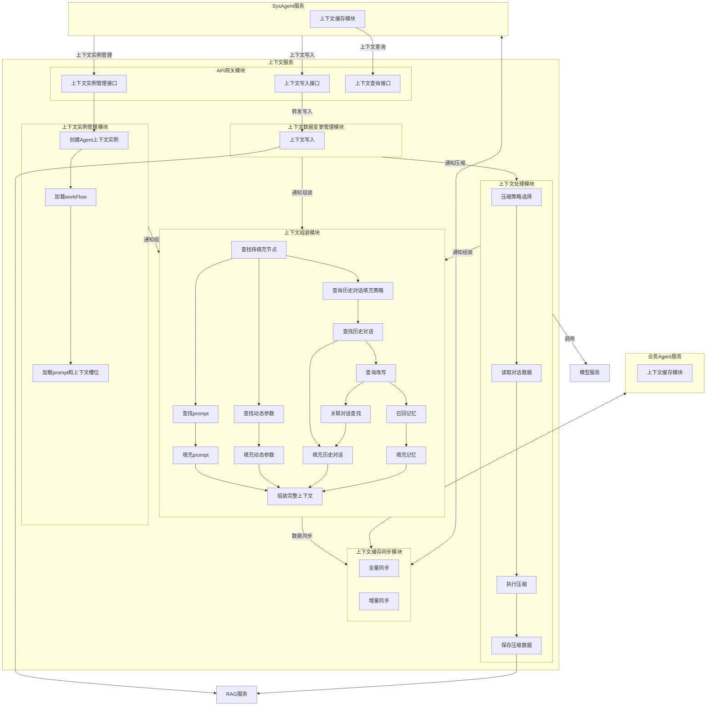
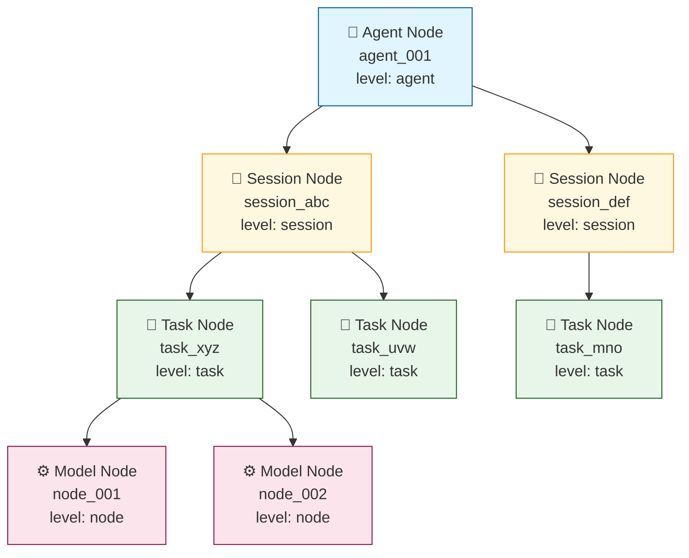
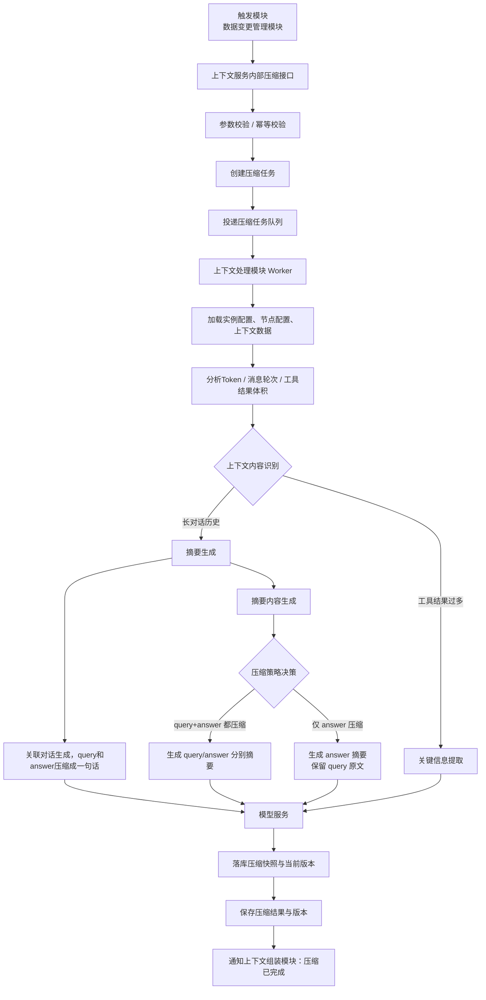

# 上下文服务设计文档

## 1. 概述

### 1.1 背景
上下文服务是 AI 系统的核心组件，负责管理 Agent 会话的上下文数据，包括上下文创建、存储、查询、压缩和同步等功能。

### 1.2 目标
- 提供统一的上下文管理能力，支持业务 Agent 和 SysAgent
- 实现高效的上下文缓存同步机制
- 支持上下文压缩，优化存储和传输
- 提供灵活的上下文组装能力

### 1.3 术语说明
| 术语 | 说明 |
|------|------|
| Agent | 智能体，包括业务 Agent 和 SysAgent |
| 上下文 | Agent 会话的历史记录、状态信息 |
| 上下文实例 | 特定 Agent 的上下文对象 |
| RAG | 检索增强生成服务（内置关系数据库） |

---

## 2. 架构设计

### 2.1 整体架构

```
┌─────────────────┐     ┌─────────────────┐
│  业务Agent服务   │     │   SysAgent服务   │
│  (上下文缓存)    │     │  (上下文缓存)    │
└────────┬────────┘     └────────┬────────┘
         │                       │
         │    ┌─────────────┐    │
         └────┤  上下文服务  ├────┘
              │  ContextSvc │
              └──────┬──────┘
                     │
                     ▼
            ┌─────────────────┐
            │   RAG服务        │
            │  (关系库+向量库)  │
            └─────────────────┘
```

### 2.2 模块划分

上下文服务包含以下核心模块：

| 模块 | 职责 |
|------|------|
| API网关模块 | 对外提供统一接口，包括实例管理、上下文写入、查询 |
| 上下文实例管理模块 | 管理 Agent 上下文实例的生命周期 |
| 上下文数据变更管理模块 | 处理上下文数据的变更和持久化 |
| 上下文处理模块 | 执行上下文压缩策略 |
| 上下文组装模块 | 组装完整上下文，供 LLM 使用 |
| 上下文缓存同步模块 | 与 Agent 端缓存进行双向同步 |

### 2.3 整体流程图



**流程说明**：

1. **SysAgent** 通过 API 网关调用上下文服务：
   - 调用「上下文实例管理接口」创建/更新/删除实例
   - 调用「上下文写入接口」写入会话数据

2. **上下文服务内部流转**：
   - 「上下文实例管理模块」创建实例后，通知「上下文组装模块」预装填
   - 「上下文数据变更管理模块」写入数据后，通知「上下文处理模块」压缩，同时通知「上下文组装模块」更新
   - 「上下文处理模块」压缩完成后，通知「上下文组装模块」重新组装
   - 「上下文组装模块」完成组装后，通过「上下文缓存同步模块」同步到 Agent

3. **外部依赖**：
   - **RAG服务**：用于数据持久化存储
   - **模型服务**：用于压缩时的摘要生成

4. **缓存同步**：
   - 「上下文缓存同步模块」与业务 Agent 和 SysAgent 进行双向全量/增量同步

---

## 3. 模块详细设计

### 3.1 API网关模块

**职责**：对外暴露统一的上下文服务接口，负责请求路由、协议转换、权限校验。

**接口列表**：

| 接口 | 功能 | 调用方 |
|------|------|--------|
| 上下文实例管理接口 | 创建/更新/删除上下文实例 | SysAgent |
| 上下文写入接口 | 写入会话数据 | SysAgent、业务Agent |
| 上下文查询接口 | 查询上下文数据 | SysAgent |

**数据流**：
```
SysAgent → 上下文写入接口 → 上下文数据变更管理模块 → RAG
```

**接口定义**：

**1. 创建上下文实例接口**

| 项目 | 说明 |
|------|------|
| **接口地址** | `POST /context/v1/instance/create` |
| **调用方** | SysAgent |
| **功能描述** | 创建新的上下文实例，初始化模型调用链和Prompt模板 |

**Request参数**：

| 参数名 | 类型 | 必填 | 说明 |
|--------|------|------|------|
| agent_id | string | 是 | Agent唯一标识 |
| session_id | string | 是 | 会话唯一标识 |
| task_id | string | 否 | 任务唯一标识，task级实例必填 |
| agenttype | string | 是 | Agent类型枚举：sys_agent, qa_agent, travel_agent, shopping_agent, movie_agent |

**Response参数**：

| 参数名 | 类型 | 说明 |
|--------|------|------|
| code | int | 状态码，0表示成功 |
| message | string | 状态描述 |
| data.instance_id | string | 实例唯一标识 |

**调用示例**：

```bash
curl -X POST http://localhost:8080/context/v1/instance/create \
  -H "Content-Type: application/json" \
  -H "X-API-Key: your-api-key" \
  -d '{
    "agent_id": "agent_001",
    "session_id": "session_abc123",
    "task_id": "task_xyz789",
    "agenttype": "qa_agent"
  }'
```

**响应示例**：

```json
{
  "code": 0,
  "message": "success",
  "data": {
    "instance_id": "inst_001"
  }
}
```

---

**2. 更新上下文实例接口**

| 项目 | 说明 |
|------|------|
| **接口地址** | `PUT /context/v1/instance/{instance_id}/update` |
| **调用方** | SysAgent |
| **功能描述** | 更新指定实例的参数和上下文数据 |

**Path参数**：

| 参数名 | 类型 | 说明 |
|--------|------|------|
| instance_id | string | 实例唯一标识 |

**Request参数**：

| 参数名 | 类型 | 必填 | 说明 |
|--------|------|------|------|
| params | object | 否 | 更新的参数值 |
| context_data | object | 否 | 更新的上下文数据 |

**Response参数**：

| 参数名 | 类型 | 说明 |
|--------|------|------|
| code | int | 状态码 |
| message | string | 状态描述 |
| data.instance_id | string | 实例唯一标识 |
| data.updated_at | string | 更新时间戳 |

**调用示例**：

```bash
curl -X PUT http://localhost:8080/context/v1/instance/inst_001/update \
  -H "Content-Type: application/json" \
  -H "X-API-Key: your-api-key" \
  -d '{
    "params": {
      "temperature": 0.8,
      "max_tokens": 2000
    },
    "context_data": {
      "user_preference": "concise"
    }
  }'
```

**响应示例**：

```json
{
  "code": 0,
  "message": "success",
  "data": {
    "instance_id": "inst_001",
    "updated_at": "2026-03-08T14:30:00Z"
  }
}
```

---

**3. 删除上下文实例接口**

| 项目 | 说明 |
|------|------|
| **接口地址** | `DELETE /context/v1/instance/{instance_id}` |
| **调用方** | SysAgent |
| **功能描述** | 删除指定上下文实例，释放资源 |

**Path参数**：

| 参数名 | 类型 | 说明 |
|--------|------|------|
| instance_id | string | 实例唯一标识 |

**Response参数**：

| 参数名 | 类型 | 说明 |
|--------|------|------|
| code | int | 状态码 |
| message | string | 状态描述 |

**调用示例**：

```bash
curl -X DELETE http://localhost:8080/context/v1/instance/inst_001 \
  -H "X-API-Key: your-api-key"
```

**响应示例**：

```json
{
  "code": 0,
  "message": "success"
}
```

---

**4. 上下文写入接口**

| 项目 | 说明 |
|------|------|
| **接口地址** | `POST /context/v1/write` |
| **调用方** | SysAgent、业务Agent |
| **功能描述** | 写入会话数据，触发后续处理和组装流程 |

**Request参数**：

| 参数名 | 类型 | 必填 | 说明 |
|--------|------|------|------|
| agent_id | string | 是 | Agent唯一标识 |
| session_id | string | 是 | 会话唯一标识 |
| task_id | string | 否 | 任务唯一标识 |
| messages | array | 否 | 对话消息列表 |
| tool_results | array | 否 | 工具调用结果列表 |
| dynamic_params | object | 否 | 动态参数键值对 |
| metadata | object | 否 | 元数据信息 |

**参数结构详情**：

```json
{
  "agent_id": "agent_001",
  "session_id": "session_abc123",
  "task_id": "task_xyz789",
  "messages": [
    {
      "role": "user",
      "content": "你好",
      "timestamp": "2026-03-08T10:00:00Z"
    },
    {
      "role": "assistant",
      "content": "您好！有什么可以帮助您的？",
      "timestamp": "2026-03-08T10:00:05Z"
    }
  ],
  "tool_results": [
    {
      "tool_id": "search_tool",
      "tool_name": "天气查询",
      "invocation_id": "inv_001",
      "status": "success",
      "input": {"city": "北京"},
      "output": {"temperature": 25, "weather": "晴"},
      "timestamp": "2026-03-08T10:00:10Z"
    }
  ],
  "dynamic_params": {
    "user_location": "北京",
    "preferred_language": "zh-CN"
  }
}
```

**Response参数**：

| 参数名 | 类型 | 说明 |
|--------|------|------|
| code | int | 状态码 |
| message | string | 状态描述 |
| data.context_id | string | 上下文数据标识 |

**调用示例**：

```bash
curl -X POST http://localhost:8080/context/v1/write \
  -H "Content-Type: application/json" \
  -H "X-API-Key: your-api-key" \
  -d '{
    "agent_id": "agent_001",
    "session_id": "session_abc123",
    "task_id": "task_xyz789",
    "messages": [
      {
        "role": "user",
        "content": "北京今天天气怎么样？",
        "timestamp": "2026-03-08T10:00:00Z"
      }
    ],
    "tool_results": [
      {
        "tool_id": "weather_query",
        "tool_name": "天气查询",
        "invocation_id": "inv_001",
        "status": "success",
        "input": {"city": "北京"},
        "output": {"temperature": 25, "weather": "晴", "humidity": 40},
        "timestamp": "2026-03-08T10:00:10Z"
      }
    ],
    "dynamic_params": {
      "user_location": "北京",
      "preferred_language": "zh-CN"
    },
    "metadata": {
      "source": "web",
      "version": "1.0"
    }
  }'
```

**响应示例**：

```json
{
  "code": 0,
  "message": "success",
  "data": {
    "context_id": "ctx_001"
  }
}
```

---

**5. 上下文查询接口**

| 项目 | 说明 |
|------|------|
| **接口地址** | `GET /context/v1/query` |
| **调用方** | SysAgent |
| **功能描述** | 查询指定Agent/Session的上下文数据 |

**Query参数**：

| 参数名 | 类型 | 必填 | 说明 |
|--------|------|------|------|
| agent_id | string | 是 | Agent唯一标识 |
| session_id | string | 是 | 会话唯一标识 |
| task_id | string | 否 | 任务唯一标识 |

**Response参数**：

| 参数名 | 类型 | 说明 |
|--------|------|------|
| code | int | 状态码 |
| message | string | 状态描述 |
| data.context.instance_id | string | 实例标识 |
| data.context.messages | array | 消息列表 |
| data.context.parameters | object | 参数值 |

**调用示例**：

```bash
curl -X GET "http://localhost:8080/context/v1/query?agent_id=agent_001&session_id=session_abc123&task_id=task_xyz789" \
  -H "X-API-Key: your-api-key"
```

**响应示例**：

```json
{
  "code": 0,
  "message": "success",
  "data": {
    "context": {
      "instance_id": "inst_001",
      "agent_id": "agent_001",
      "session_id": "session_abc123",
      "task_id": "task_xyz789",
      "messages": [
        {
          "role": "user",
          "content": "北京今天天气怎么样？",
          "timestamp": "2026-03-08T10:00:00Z"
        },
        {
          "role": "assistant",
          "content": "北京今天天气晴朗，气温25度。",
          "timestamp": "2026-03-08T10:00:15Z"
        }
      ],
      "parameters": {
        "temperature": 0.7,
        "max_tokens": 2000
      }
    }
  }
}
```

---

### 3.2 上下文实例管理模块

**职责**：管理上下文实例的创建、初始化、销毁。系统启动时预加载所有Agent配置，实例创建时快速绑定预置配置。

**预置配置说明**：

系统首次启动时会从本上下文服务的配置文件中加载并缓存以下预置数据，**同时为每个 Agent 在数据库中创建默认实例模板**。

**配置文件目录结构**：

```
/config
├── agents/                          # Agent配置文件目录
│   ├── sys_agent.yaml              # SysAgent配置
│   ├── qa_agent.yaml               # 问答Agent配置
│   ├── travel_agent.yaml           # 旅游Agent配置
│   ├── shopping_agent.yaml         # 购物Agent配置
│   └── movie_agent.yaml            # 电影Agent配置
├── templates/                       # Prompt模板目录
│   ├── system/                     # System Prompt模板
│   │   ├── intent_recognition_sys_v1.txt
│   │   └── answer_generation_sys_v1.txt
│   └── user/                       # User Prompt模板
│       ├── intent_recognition_user_v1.txt
│       └── answer_generation_user_v1.txt
└── global.yaml                     # 全局配置
```

**配置加载规则**：
- 服务启动时扫描 `/config/agents/` 目录下所有 `.yaml` 文件
- 每个 AgentType 对应一个独立的配置文件
- 配置文件名格式：`{agenttype}.yaml`
- 配置文件变更后需重启服务生效（或调用热更新接口）

**预置数据内容**：

| 预置数据 | 内容说明 | 配置时机 | 配置文件位置 |
|----------|----------|----------|--------------|
| **工作流配置** | Agent类型的标准执行流程、步骤依赖关系 | 系统启动时 | `/config/agents/{agenttype}.yaml` |
| **模型编排节点** | 模型调用顺序、策略、fallback配置、超时重试参数 | 系统启动时 | `/config/agents/{agenttype}.yaml` |
| **Prompt模板** | System Prompt、User Prompt、Model Specific Prompts | 系统启动时 | `/config/agents/{agenttype}.yaml` + `/config/templates/` |
| **槽位参数定义** | 输入参数、动态参数、输出参数的定义和校验规则 | 系统启动时 | `/config/agents/{agenttype}.yaml` |

**默认实例模板创建（服务启动时）**：

服务启动时，读取配置文件后，将配置内容解析并插入数据库 `context_template` 表作为默认模板：

```python
# 伪代码：服务启动时从配置文件加载并创建模板
config = load_yaml(f"/config/agents/{agenttype}.yaml")

# 1. 插入 Agent 模板
agent_template_id = f"agent_{agenttype}_template"
insert_context_template(
    id=agent_template_id,
    level="agent",
    agenttype=agenttype,
    agent_id=f"{agenttype}_template",
    version="1.0"
)

# 2. 插入 Session 模板
session_template_id = f"sess_{agenttype}_template"
insert_context_template(
    id=session_template_id,
    level="session",
    agenttype=agenttype,
    agent_id=f"{agenttype}_template",
    session_id="template",
    session_name="默认会话模板",
    version="1.0"
)

# 3. 插入 Task 模板
task_template_id = f"task_{agenttype}_template"
insert_context_template(
    id=task_template_id,
    level="task",
    agenttype=agenttype,
    agent_id=f"{agenttype}_template",
    session_id="template",
    task_id="template",
    task_type="default",
    task_name="默认任务模板",
    version="1.0"
)

# 4. 遍历 workflow nodes，插入 Node 模板
for node in config.workflow.nodes:
    node_template_id = f"node_task_{agenttype}_template_{node.node_id}"
    insert_context_template(
        id=node_template_id,
        level="node",
        agenttype=agenttype,
        agent_id=f"{agenttype}_template",
        session_id="template",
        task_id="template",
        node_order=node.order,
        node_type=node.node_type,
        model_config=json.dumps(node),  # 存储完整node配置
        system_prompt=node.system_prompt.content,
        user_prompt=node.user_prompt.content,
        version="1.0"
    )
```

**对应 SQL 语句**：

```sql
-- 插入 Agent 模板（从配置文件解析）
INSERT INTO context_template (id, level, agenttype, agent_id, version)
VALUES ('agent_{agenttype}_template', 'agent', '{agenttype}', '{agenttype}_template', '1.0');

-- 插入 Session 模板（从配置文件解析）
INSERT INTO context_template (id, level, agenttype, agent_id, session_id, session_name, version)
VALUES ('sess_{agenttype}_template', 'session', '{agenttype}', '{agenttype}_template', 'template', '默认会话模板', '1.0');

-- 插入 Task 模板（从配置文件解析）
INSERT INTO context_template (id, level, agenttype, agent_id, session_id, task_id, task_type, task_name, version)
VALUES ('task_{agenttype}_template', 'task', '{agenttype}', '{agenttype}_template', 'template', 'template', 'default', '默认任务模板', '1.0');

-- 基于 workflow.nodes 配置插入 Node 模板（从配置文件解析每个node）
INSERT INTO context_template (id, level, agenttype, agent_id, session_id, task_id,
    node_order, node_type, model_config, system_prompt, user_prompt, version)
VALUES ('node_task_{agenttype}_template_{node_id}', 'node', '{agenttype}', '{agenttype}_template',
    'template', 'template', {node.order}, '{node.node_type}',
    '{node_config_json}', '{node.system_prompt.content}', '{node.user_prompt.content}', '1.0');
```

**模板用途**：
- 作为新实例创建的**复制源**，避免每次从配置文件重新解析
- 缓存已渲染的 Prompt 模板和模型配置
- 加速实例创建流程（直接从模板表复制，而非配置文件解析）


**核心流程**：

```
接收请求 → 解析验证 → 绑定预置配置 → 构建实例 → 通知下游
```

**详细流程**：

```
接收请求 → 解析验证 → 加载预置配置 → 构建实例 → 持久化存储 → 通知下游
```

#### 步骤1：接收请求
- 接收实例创建/更新/删除请求
- 请求参数：
  | 参数名 | 类型 | 必填 | 说明 |
  |--------|------|------|------|
  | agent_id | string | 是 | Agent唯一标识 |
  | session_id | string | 是 | 会话唯一标识 |
  | task_id | string | 否 | 任务唯一标识（task级实例必填）|
  | agenttype | string | 是 | Agent类型枚举：sys_agent, qa_agent, travel_agent, shopping_agent, movie_agent |

#### 步骤2：解析验证
- 解析请求参数，提取 agent_id、session_id、task_id、agenttype
- 验证 agenttype 对应的预置配置是否已加载（检查内存中的配置缓存）
- 校验调用方权限（API Key 验证）
- 若 task_id 为空，创建 session 级实例；否则创建 task 级实例

#### 步骤3：加载预置配置
从本地配置文件加载对应 agenttype 的配置：

| 配置项 | 配置文件路径 | 说明 |
|--------|--------------|------|
| 模型编排配置 | `/config/agents/{agenttype}.yaml` | 模型调用链配置、路由规则 |
| Prompt模板库 | `/config/agents/{agenttype}.yaml` + `/config/templates/` | System Prompt、User Prompt、Model Specific Prompts |
| 参数定义 | `/config/agents/{agenttype}.yaml` | 输入参数、动态参数、输出参数定义 |
| WorkFlow配置 | `/config/agents/{agenttype}.yaml` | 工作流步骤、依赖关系 |
| 上下文槽位定义 | `/config/agents/{agenttype}.yaml` | session、memory、tool 槽位配置 |

**配置加载流程**：
1. 根据 `agenttype` 确定配置文件路径（如 `/config/agents/qa_agent.yaml`）
2. 从内存缓存中读取已加载的配置（服务启动时已预加载）
3. 若缓存未命中，实时读取配置文件并解析
4. 将配置内容绑定到当前实例构建上下文

#### 步骤4：基于默认模板创建实例记录
上下文服务启动时，已为每个 Agent 在数据库中创建了**默认实例模板**。收到创建实例请求后，基于该模板复制出新的实例记录：

**默认实例模板结构（创建时参考）**：
```
默认Agent模板 (level=agent, id=agent_{agenttype}_template)
├── 默认Session模板 (level=session)
│   └── 默认Task模板 (level=task)
│       ├── Node模板-意图识别 (level=node)
│       └── Node模板-答案生成 (level=node)
```

**4.1 复制 Agent 层级记录**
基于默认模板，插入新的 Agent 实例记录：

```sql
INSERT INTO context_instance (
    id, level, agenttype, agent_id, current_session_id, status, template_id, template_version, created_at, updated_at
)
SELECT
    'agent_{agent_id}',              -- 新生成的Agent实例ID
    'agent',
    agenttype,
    '{agent_id}',                    -- 请求中的agent_id
    'sess_{agent_id}_{session_id}',  -- 新session ID
    'active',
    id,                              -- 来源模板ID
    version,                         -- 来源模板版本
    NOW(), NOW()
FROM context_template
WHERE id = 'agent_{agenttype}_template' AND level = 'agent';
```

**4.2 复制 Session 层级记录**
基于默认模板，插入新的 Session 实例记录：

```sql
INSERT INTO context_instance (
    id, level, agent_id, session_id, session_name, status, template_id, template_version, created_at, updated_at
)
SELECT
    'sess_{agent_id}_{session_id}',  -- 新生成的Session ID
    'session',
    '{agent_id}',
    '{session_id}',                  -- 请求中的session_id
    COALESCE(NULLIF('{session_name}', ''), session_name, '新会话'),
    'active',
    id,
    version,
    NOW(), NOW()
FROM context_template
WHERE agenttype = '{agenttype}' AND level = 'session' AND session_id = 'template';
```

**4.3 复制 Task 层级记录**
基于默认模板，插入新的 Task 实例记录：

```sql
INSERT INTO context_instance (
    id, level, agent_id, session_id, task_id, task_type, task_name, status, template_id, template_version, created_at, updated_at
)
SELECT
    'task_{agent_id}_{session_id}_{task_id}',  -- 新生成的Task ID
    'task',
    '{agent_id}',
    '{session_id}',
    COALESCE('{task_id}', 'task_default'),     -- 请求中的task_id或默认值
    task_type,
    task_name,
    'active',
    id,
    version,
    NOW(), NOW()
FROM context_template
WHERE agenttype = '{agenttype}' AND level = 'task' AND task_id = 'template';
```

**4.4 复制 Node 层级记录**
基于默认模板中的 nodes 配置，批量复制 Node 实例记录：

```sql
INSERT INTO context_instance (
    id, level, agent_id, session_id, task_id,
    node_order, node_type, model_config,
    system_prompt, user_prompt, status, template_id, template_version, created_at, updated_at
)
SELECT
    'node_task_{agent_id}_{session_id}_{task_id}_' || SUBSTRING_INDEX(id, '_', -1),  -- 从模板ID提取node_id
    'node',
    '{agent_id}',
    '{session_id}',
    COALESCE('{task_id}', 'task_default'),
    node_order,
    node_type,
    model_config,           -- 复制完整的模型配置（含context_requirements等）
    system_prompt,          -- 复制System Prompt模板
    user_prompt,            -- 复制User Prompt模板
    'pending',              -- 初始状态
    id,                     -- 来源模板ID
    version,                -- 来源模板版本
    NOW(), NOW()
FROM context_template
WHERE agenttype = '{agenttype}' AND level = 'node' AND task_id = 'template';
```

**复制时的字段映射规则**：

| 模板字段 | 新实例字段 | 处理方式 |
|----------|------------|----------|
| 模板ID | 新实例ID | 替换为 `{agent_id}_{session_id}_{task_id}` 格式 |
| agenttype | agenttype | 保持不变 |
| agent_id | agent_id | 使用请求中的 agent_id |
| session_id | session_id | 使用请求中的 session_id |
| task_id | task_id | 使用请求中的 task_id 或生成默认值 |
| system_prompt | system_prompt | 复制模板内容（支持变量渲染） |
| user_prompt | user_prompt | 复制模板内容 |
| model_config | model_config | 完整复制（含workflow、槽位定义等） |
| status | status | 重置为 active/pending |

**4.5 初始化实例参数槽位**
从模板的槽位定义初始化空值：

```json
{
  "parameter_values": {
    "input": {},           -- 等待用户请求填充
    "dynamic": {},         -- 运行时动态计算
    "output": {}           -- 模型执行后填充
  },
  "context_slots": {
    "session_context": {"status": "empty", "data": {}, "token_count": 0},
    "memory_context": {"status": "empty", "data": {}, "retrieved_memories": []},
    "tool_context": {"status": "empty", "data": {}}
  },
  "template_reference": "agent_{agenttype}_template"  -- 记录模板来源
}
```

#### 步骤5：通知下游
实例创建完成后，通知相关模块进行后续处理：

- **通知上下文组装模块**：触发预装填流程（加载session上下文、召回记忆）

**数据模型**：

**AgentConfig（完整Agent配置模型）**

```json
{
  "agenttype": "qa_agent",
  "version": "1.0",

  "workflow": {
    "workflow_id": "wf_qa_v1",
    "name": "问答Agent工作流",
    "description": "标准问答流程：意图识别 -> 答案生成",

    "nodes": [
      {
        "node_id": "intent_recognition",
        "node_type": "model",
        "name": "意图识别",
        "description": "分析用户query，识别意图和槽位",
        "order": 1,

        "system_prompt": {
          "template_id": "intent_recognition_sys_v1",
          "content": "你是一个专业的意图识别助手。请分析用户的输入，识别出用户的意图和关键槽位信息。\n\n注意事项：\n1. 意图分类必须在预定义的分类列表中\n2. 槽位提取要准确，缺失的槽位标记为null\n3. 返回格式必须是合法的JSON",
          "variables": []
        },

        "user_prompt": {
          "template_id": "intent_recognition_user_v1",
          "content": "用户输入：{{user_original_query}}\n\n请识别用户意图并提取槽位，以JSON格式返回：\n{\n  \"intent\": \"意图分类\",\n  \"slots\": {\n    \"槽位名\": \"槽位值\"\n  },\n  \"confidence\": 0.95\n}",
          "variables": ["user_original_query"]
        },

        "context_requirements": {
          "required_slots": [
            {
              "slot_id": "user_original_query",
              "slot_type": "input",
              "description": "用户原始query",
              "fill_strategy": "direct_input",
              "data_type": "string",
              "required": true
            },
            {
              "slot_id": "user_rewritten_query",
              "slot_type": "dynamic",
              "description": "改写后的query",
              "fill_strategy": "preprocess",
              "depends_on": ["user_original_query"],
              "data_type": "string",
              "required": false
            }
          ],
          "history_messages": {
            "enabled": true,
            "max_turns": 3,
            "max_tokens": 3000,
            "filter_strategy": "relevance",
            "relevance_threshold": 0.7
          },
          "memory_context": {
            "enabled": false
          }
        },

        "input_mapping": {
          "query": "{{user_rewritten_query}}",
          "history_messages": "{{history_messages}}"
        },

        "next_nodes": {
          "default": "answer_generation"
        }
      },
      {
        "node_id": "answer_generation",
        "node_type": "model",
        "name": "答案生成",
        "description": "基于上下文生成最终答案",
        "order": 2,
        "dependencies": ["intent_recognition"],

        "system_prompt": {
          "template_id": "answer_generation_sys_v1",
          "content": "你是一个专业的问答助手。基于用户的原始问题、识别出的意图和相关上下文信息，生成准确、有帮助的回答。\n\n回答要求：\n1. 回答要直接针对用户的问题\n2. 可以引用提供的历史对话和记忆信息\n3. 如果不确定，请诚实说明\n4. 保持友好、专业的语气",
          "variables": ["intent", "memories"]
        },

        "user_prompt": {
          "template_id": "answer_generation_user_v1",
          "content": "用户问题：{{user_original_query}}\n\n识别意图：{{intent}}\n\n\n相关记忆：\n{{memories}}\n\n\n\n历史对话：\n{{history_messages}}\n\n\n请根据以上信息生成回答：",
          "variables": ["user_original_query", "intent", "memories", "history_messages"]
        },

        "context_requirements": {
          "required_slots": [
            {
              "slot_id": "user_original_query",
              "slot_type": "input",
              "description": "展示给用户看的问题",
              "data_type": "string",
              "required": true
            },
            {
              "slot_id": "intent",
              "slot_type": "upstream_output",
              "source_node": "intent_recognition",
              "source_field": "intent",
              "data_type": "string",
              "required": true
            }
          ],
          "history_messages": {
            "enabled": true,
            "max_turns": 5,
            "filter_strategy": "sequential"
          },
          "memory_context": {
            "enabled": true,
            "retrieval_count": 2,
            "semantic_search": true
          }
        },

        "input_mapping": {
          "question": "{{user_original_query}}",
          "intent": "{{intent}}",
          "history": "{{history_messages}}",
          "memories": "{{memory_context}}"
        },

        "next_nodes": {
          "default": null
        }
      }
    ],

    "global_context": {
      "available_slots": [
        {
          "slot_id": "user_original_query",
          "slot_type": "input",
          "data_type": "string",
          "required": true,
          "description": "用户输入的原始query"
        },
        {
          "slot_id": "user_rewritten_query",
          "slot_type": "dynamic",
          "data_type": "string",
          "required": false,
          "default_value": null,
          "description": "改写优化后的query"
        },
        {
          "slot_id": "session_id",
          "slot_type": "meta",
          "data_type": "string",
          "required": true,
          "description": "会话唯一标识"
        },
        {
          "slot_id": "user_id",
          "slot_type": "meta",
          "data_type": "string",
          "required": false,
          "description": "用户唯一标识"
        }
      ],

    "error_handling": {
      "on_node_failure": {
        "strategy": "fallback",
        "fallback_node": null,
        "max_failures": 3
      },
      "on_timeout": {
        "strategy": "retry",
        "max_retries": 2
      }
    }
  }
}
```

**配置模型说明**

| 配置项 | 说明 |
|--------|------|
| `agenttype` | Agent类型标识，如 qa_agent、travel_agent |
| `version` | 配置版本号，用于配置更新管理 |
| `workflow` | 工作流定义，包含节点列表、全局上下文、错误处理 |
| `workflow.nodes` | 节点配置列表，每个节点包含模型配置、上下文需求、路由规则、Prompt配置 |
| `workflow.nodes[].system_prompt` | 节点的System Prompt配置，包含模板ID、内容、变量 |
| `workflow.nodes[].user_prompt` | 节点的User Prompt配置，包含模板ID、内容、变量，支持条件渲染 |
| `workflow.global_context` | 全局槽位定义和可见性策略 |
| `workflow.error_handling` | 节点失败和超时时的处理策略 |


**ContextRequirement说明**

上下文需求配置定义了节点执行所需的上下文数据：
- `required_slots`：必需槽位列表，包含输入参数、动态参数、上游节点输出
- `history_messages`：历史对话消息配置（轮数、过滤策略）
- `session_context`：会话级上下文字段
- `memory_context`：记忆召回配置

**Slot类型说明**

| 类型 | 来源 | 说明 |
|------|------|------|
| `input` | 用户输入 | 直接从请求中获取的参数 |
| `dynamic` | 预处理 | 通过预处理逻辑生成的参数 |
| `upstream_output` | 上游节点 | 依赖节点的输出结果 |
| `meta` | 元数据 | 会话ID、用户ID等元信息 |


#### AgentConfig 核心字段

| 字段名 | 说明 | 使用模块 |
|--------|------|----------|
| agenttype | Agent类型标识 | 实例管理 |
| version | 配置版本号 | 实例管理 |
| workflow | 工作流配置 | 实例管理 |
| workflow.nodes | 节点配置列表，每个节点包含Prompt配置、上下文需求、路由规则 | 实例管理 |
| workflow.nodes[].system_prompt | 节点的System Prompt配置 | 实例管理、组装 |
| workflow.nodes[].user_prompt | 节点的User Prompt配置 | 实例管理、组装 |
| workflow.global_context | 全局槽位定义和可见性策略 | 实例管理 |
| workflow.error_handling | 节点失败和超时时的处理策略 | 实例管理 |


**数据存储设计**

上下文数据采用双表设计分离存储：**模板表**（context_template）存储配置元数据，**实例表**（context_instance）存储运行时数据。

### 双表设计

```
┌─────────────────────────────────────────────────────────────┐
│  context_template（模板表）                                  │
│  - 存储Agent配置模板（每个AgentType一套）                    │
│  - 数据量小，相对稳定                                        │
│  - 服务启动时从配置文件加载                                  │
└─────────────────────────────────────────────────────────────┘
                             │
                             │ 复制
                             ▼
┌─────────────────────────────────────────────────────────────┐
│  context_instance（实例表）                                  │
│  - 存储运行时实例数据（每个请求创建一套）                    │
│  - 数据量大，动态增长                                        │
│  - 可独立分库分表                                            │
└─────────────────────────────────────────────────────────────┘
```

#### 模板表（context_template）

存储从配置文件解析的默认模板，作为实例创建的复制源：

```sql
-- =============================================
-- 上下文模板表
-- 存储从配置文件加载的默认模板
-- =============================================
CREATE TABLE context_template (
    -- 主键和层级标识
    id                  VARCHAR(64) PRIMARY KEY COMMENT '模板唯一标识',
    level               VARCHAR(16) NOT NULL COMMENT '层级: agent/session/task/node',
    agenttype           VARCHAR(32) NOT NULL COMMENT 'Agent类型',

    -- 各层级的标识（模板使用固定标识）
    agent_id            VARCHAR(64) COMMENT '模板Agent标识（固定值）',
    session_id          VARCHAR(64) COMMENT '模板Session标识（固定值）',
    task_id             VARCHAR(64) COMMENT '模板Task标识（固定值）',
    node_order          INT COMMENT '执行顺序（仅node层级）',

    -- 层级特定字段
    session_name        VARCHAR(256) COMMENT '会话名称模板',
    task_type           VARCHAR(32) COMMENT '任务类型',
    task_name           VARCHAR(256) COMMENT '任务名称模板',
    node_type           VARCHAR(32) DEFAULT 'llm' COMMENT '节点类型',

    -- 配置内容（核心字段）
    model_config        JSON COMMENT '模型配置（含workflow、context_requirements等）',
    system_prompt       TEXT COMMENT '系统提示词模板',
    user_prompt         TEXT COMMENT '用户提示词模板',

    -- 版本管理
    version             VARCHAR(32) DEFAULT '1.0' COMMENT '配置版本号',

    -- 时间戳
    created_at          TIMESTAMP DEFAULT CURRENT_TIMESTAMP,
    updated_at          TIMESTAMP DEFAULT CURRENT_TIMESTAMP ON UPDATE CURRENT_TIMESTAMP,

    -- 索引
    INDEX idx_level (level),
    INDEX idx_agenttype (agenttype),
    INDEX idx_level_agenttype (level, agenttype),
    INDEX idx_version (version)
) COMMENT='上下文模板表';
```

#### 实例表（context_instance）

存储运行时创建的实例数据，字段与模板表类似但增加运行时字段：

```sql
-- =============================================
-- 上下文实例表
-- 存储从模板复制生成的运行时实例
-- =============================================
CREATE TABLE context_instance (
    -- 主键和层级标识
    id                  VARCHAR(64) PRIMARY KEY COMMENT '实例唯一标识',
    level               VARCHAR(16) NOT NULL COMMENT '层级: agent/session/task/node',
    agenttype           VARCHAR(32) COMMENT 'Agent类型',

    -- 各层级的业务标识（运行时真实值）
    agent_id            VARCHAR(64) COMMENT '所属Agent ID',
    session_id          VARCHAR(64) COMMENT '所属Session ID',
    task_id             VARCHAR(64) COMMENT '所属Task ID',
    node_order          INT COMMENT '执行顺序（仅node层级）',

    -- 通用状态
    status              VARCHAR(16) DEFAULT 'active' COMMENT '状态',

    -- ===== Agent层级字段 =====
    current_session_id  VARCHAR(64) COMMENT '当前活跃会话ID（仅agent层级）',

    -- ===== Session层级字段 =====
    session_name        VARCHAR(256) COMMENT '会话名称（实际值）',

    -- ===== Task层级字段 =====
    task_type           VARCHAR(32) COMMENT '任务类型',
    task_name           VARCHAR(256) COMMENT '任务名称（实际值）',

    -- ===== Model Node层级字段 =====
    node_type           VARCHAR(32) DEFAULT 'llm' COMMENT '节点类型',
    model_config        JSON COMMENT '模型配置（从模板复制）',

    -- Token消耗
    total_tokens        INT DEFAULT 0 COMMENT '总Token数',

    -- ===== 上下文内容（仅node层级） =====
    system_prompt       TEXT COMMENT '系统提示词（渲染后）',
    user_prompt         TEXT COMMENT '用户提示词模板',
    user_message        TEXT COMMENT '用户原始消息',
    user_original_query TEXT COMMENT '用户原始query',
    user_rewritten_query TEXT COMMENT '用户改写后query',
    input_messages      JSON COMMENT '输入消息列表',
    tool_results        JSON COMMENT '工具调用结果',
    dynamic_params      JSON COMMENT '动态参数值',

    -- 关联模板（用于追溯和更新）
    template_id         VARCHAR(64) COMMENT '来源模板ID',
    template_version    VARCHAR(32) COMMENT '来源模板版本',

    -- 时间戳
    created_at          TIMESTAMP DEFAULT CURRENT_TIMESTAMP,
    updated_at          TIMESTAMP DEFAULT CURRENT_TIMESTAMP ON UPDATE CURRENT_TIMESTAMP,
    started_at          TIMESTAMP COMMENT '开始执行时间',
    completed_at        TIMESTAMP COMMENT '完成时间',

    -- 索引
    INDEX idx_level (level),
    INDEX idx_agent_id (agent_id),
    INDEX idx_session_id (session_id),
    INDEX idx_task_id (task_id),
    INDEX idx_agenttype (agenttype),
    INDEX idx_status (status),
    INDEX idx_template_id (template_id),
    INDEX idx_created_at (created_at),
    INDEX idx_level_agent (level, agent_id),
    INDEX idx_level_session (level, session_id),
    INDEX idx_level_task (level, task_id)
) COMMENT='上下文实例表';
```

#### context_template 表字段说明

| 字段名 | 类型 | 说明 | 使用模块 |
|--------|------|------|----------|
| id | VARCHAR(64) | 模板唯一标识 | 实例管理 |
| level | VARCHAR(16) | 层级: agent/session/task/node | 实例管理 |
| agenttype | VARCHAR(32) | Agent类型 | 实例管理 |
| agent_id | VARCHAR(64) | 模板Agent标识（固定值） | 实例管理 |
| session_id | VARCHAR(64) | 模板Session标识（固定值） | 实例管理 |
| task_id | VARCHAR(64) | 模板Task标识（固定值） | 实例管理 |
| node_order | INT | 执行顺序（仅node层级） | 实例管理 |
| session_name | VARCHAR(256) | 会话名称模板 | 实例管理 |
| task_type | VARCHAR(32) | 任务类型 | 实例管理 |
| task_name | VARCHAR(256) | 任务名称模板 | 实例管理 |
| node_type | VARCHAR(32) | 节点类型 | 实例管理 |
| model_config | JSON | 模型配置（含workflow、context_requirements等） | 实例管理、处理、组装 |
| system_prompt | TEXT | 系统提示词模板 | 实例管理、组装 |
| user_prompt | TEXT | 用户提示词模板 | 实例管理、组装 |
| version | VARCHAR(32) | 配置版本号 | 实例管理 |
| created_at | TIMESTAMP | 创建时间 | 实例管理 |
| updated_at | TIMESTAMP | 更新时间 | 实例管理 |

#### context_instance 表字段说明

| 字段名 | 类型 | 说明 | 使用模块 |
|--------|------|------|----------|
| id | VARCHAR(64) | 实例唯一标识 | 所有模块 |
| level | VARCHAR(16) | 层级: agent/session/task/node | 实例管理 |
| agenttype | VARCHAR(32) | Agent类型 | 实例管理 |
| agent_id | VARCHAR(64) | 所属Agent ID（运行时真实值） | 所有模块 |
| session_id | VARCHAR(64) | 所属Session ID（运行时真实值） | 所有模块 |
| task_id | VARCHAR(64) | 所属Task ID（运行时真实值） | 实例管理、数据变更 |
| node_order | INT | 执行顺序（仅node层级） | 实例管理 |
| status | VARCHAR(16) | 状态 | 所有模块 |
| current_session_id | VARCHAR(64) | 当前活跃会话ID（仅agent层级） | 实例管理 |
| session_name | VARCHAR(256) | 会话名称（实际值） | 实例管理 |
| task_type | VARCHAR(32) | 任务类型 | 实例管理 |
| task_name | VARCHAR(256) | 任务名称（实际值） | 实例管理 |
| node_type | VARCHAR(32) | 节点类型 | 实例管理 |
| model_config | JSON | 模型配置（从模板复制） | 实例管理、处理、组装 |
| total_tokens | INT | 总Token数 | 数据变更、处理 |
| system_prompt | TEXT | 系统提示词（从模板复制） | 实例管理、组装 |
| user_prompt | TEXT | 用户提示词模板（从模板复制） | 实例管理、组装 |
| user_message | TEXT | 用户原始消息 | 数据变更 |
| user_original_query | TEXT | 用户原始query | 数据变更、组装 |
| user_rewritten_query | TEXT | 用户改写后query | 数据变更、组装 |
| input_messages | JSON | 输入消息列表 | 数据变更、处理、组装 |
| tool_results | JSON | 工具调用结果 | 数据变更、处理、组装 |
| dynamic_params | JSON | 动态参数值 | 数据变更、组装、缓存 |
| template_id | VARCHAR(64) | 来源模板ID | 实例管理 |
| template_version | VARCHAR(32) | 来源模板版本 | 实例管理 |
| created_at | TIMESTAMP | 创建时间 | 所有模块 |
| updated_at | TIMESTAMP | 更新时间 | 所有模块 |
| started_at | TIMESTAMP | 开始执行时间 | 实例管理 |
| completed_at | TIMESTAMP | 完成时间 | 实例管理 |

### 层级关系示例

| id | level | parent_id | root_id | path | 说明 |
|----|-------|-----------|---------|------|------|
| agent_001 | agent | null | agent_001 | agent_001 | Agent根节点 |
| session_abc | session | agent_001 | agent_001 | agent_001/session_abc | Session节点 |
| task_xyz | task | session_abc | agent_001 | agent_001/session_abc/task_xyz | Task节点 |
| node_001 | node | task_xyz | agent_001 | agent_001/session_abc/task_xyz/node_001 | Model Node |

### 树形结构可视化



### 存储策略

| 功能 | 实现方式 | 说明 |
|------|----------|------|
| 关系查询 | RAG内置关系数据库 | 通过 `level` + `parent_id` 查询层级 |

**查询示例**：

```sql
-- 查询Agent下的所有Session
SELECT * FROM context_instance
WHERE level = 'session' AND parent_id = 'agent_001';

-- 查询Session下的所有Task
SELECT * FROM context_instance
WHERE level = 'task' AND session_id = 'session_abc';

-- 查询Task下的所有Node，按执行顺序排序
SELECT * FROM context_instance
WHERE level = 'node' AND task_id = 'task_xyz'
ORDER BY node_order;
```

---

### 3.3 上下文数据变更管理模块

**职责**：接收 API 网关模块发送的上下文数据变更请求，自动识别数据类型并持久化到 RAG 服务的 `context_instance` 表，同时建立 agent_id、session、task 的层级关系，最后通知上下文组装模块哪些信息发生了变更。

**模块关系**：
- **输入**：接收来自 API 网关模块的内部调用（非 REST 接口）
- **处理**：根据数据内容自动识别操作类型（创建/追加/合并/替换），无需外部指定
- **输出**：更新 `context_instance` 表，记录层级关系，向上下文组装模块发送变更通知

---

### 3.3.1 接收数据变更请求

API 网关模块将解析后的数据变更请求发送给本模块，数据变更管理模块不感知操作类型，仅根据数据内容自动处理：

**输入数据结构**：

```json
{
  "change_id": "chg_20240308103000001",
  "timestamp": "2026-03-08T10:30:00.000Z",
  "source": "api_gateway",
  "agent_id": "agent_001",
  "data": {
    "session": {
      "session_id": "sess_agent_001_abc123",
      "session_name": "新会话"
    },
    "task": {
      "task_id": "task_agent_001_xyz789",
      "task_name": "问答任务",
      "task_type": "qa"
    },
    "node": {
      "node_id": "intent_recognition",
      "user_original_query": "今天天气怎么样？",
      "user_message": "今天天气怎么样？",
      "input_messages": [
        {"role": "user", "content": "今天天气怎么样？", "timestamp": "2026-03-08T10:30:00Z"}
      ],
      "dynamic_params": {
        "location": "北京"
      }
    }
  }
}
```

**注**：`agent_id` 由实例管理模块预先创建，数据变更模块在此基础上创建 session、task、node。

---

### 3.3.2 自动识别操作类型

数据变更模块根据以下规则自动识别如何处理数据：

| 判断条件 | 自动识别为 | 处理逻辑 |
|----------|-----------|----------|
| 记录不存在（按层级标识查询） | **CREATE** | 从 `context_template` 复制创建新记录 |
| 字段为数组类型（input_messages, tool_results） | **APPEND** | 将新数据追加到数组尾部 |
| 字段为对象类型（dynamic_params） | **MERGE** | 新旧对象合并，新值覆盖旧值 |
| 字段为标量类型（session_name, status 等） | **REPLACE** | 直接替换旧值 |

**操作识别伪代码**：

```python
def auto_detect_operation(existing_record, field_name, new_value):
    """根据字段类型和现有记录自动识别操作类型"""

    # 1. 检查记录是否存在
    if existing_record is None:
        return 'CREATE'

    # 2. 根据字段类型决定操作
    if field_name in ['input_messages', 'tool_results']:
        # 数组类型 -> 追加
        return 'APPEND'
    elif field_name == 'dynamic_params':
        # 对象类型 -> 合并
        return 'MERGE'
    else:
        # 标量类型 -> 替换
        return 'REPLACE'

def process_field(existing_value, new_value, operation):
    """根据操作类型处理字段值"""

    if operation == 'APPEND':
        # 数组追加
        if existing_value is None:
            return new_value
        return existing_value + new_value

    elif operation == 'MERGE':
        # 对象合并
        if existing_value is None:
            return new_value
        return {**existing_value, **new_value}

    elif operation == 'REPLACE':
        # 直接替换
        return new_value

    return new_value
```

---

### 3.3.3 层级关系记录与处理流程

数据变更模块自动维护四级层级关系，确保数据一致性：

```
接收网关数据
    ↓
按层级顺序处理（Session → Task → Node）
    ↓
查询是否存在（自动识别 CREATE or UPDATE）
    ↓
执行持久化（INSERT or UPDATE）
    ↓
记录层级关系变更
    ↓
发布变更通知
```

#### 步骤1：Session 处理

**1.1 查询 Session 是否存在**

```sql
-- 查询指定 Session 是否已存在
SELECT id, session_name, status, created_at
FROM context_instance
WHERE agent_id = ? AND session_id = ? AND level = 'session';
```

**1.2 不存在则创建（自动识别为 CREATE）**

```sql
-- 从模板复制创建新 Session
INSERT INTO context_instance (
    id, level, agenttype, agent_id, session_id, session_name,
    status, template_id, template_version, created_at, updated_at
)
SELECT
    CONCAT('sess_', '{agent_id}', '_', '{session_id}'),
    'session',
    (SELECT agenttype FROM context_instance WHERE agent_id = '{agent_id}' AND level = 'agent' LIMIT 1),
    '{agent_id}',
    '{session_id}',
    COALESCE('{session_name}', '新会话'),
    'active',
    id,
    version,
    NOW(), NOW()
FROM context_template
WHERE agenttype = (
    SELECT agenttype FROM context_instance WHERE agent_id = '{agent_id}' AND level = 'agent' LIMIT 1
)
AND level = 'session' AND session_id = 'template';
```

**1.3 存在则更新（自动识别为 REPLACE）**

```sql
-- 更新 Session 信息
UPDATE context_instance
SET
    session_name = COALESCE(?, session_name),
    updated_at = NOW()
WHERE agent_id = ? AND session_id = ? AND level = 'session';
```

#### 步骤2：Task 处理

**2.1 查询 Task 是否存在**

```sql
-- 查询指定 Task 是否已存在
SELECT id, task_name, task_type, status
FROM context_instance
WHERE agent_id = ? AND session_id = ? AND task_id = ? AND level = 'task';
```

**2.2 不存在则创建（自动识别为 CREATE）**

```sql
-- 从模板复制创建新 Task
INSERT INTO context_instance (
    id, level, agenttype, agent_id, session_id, task_id,
    task_name, task_type, status, template_id, template_version,
    created_at, updated_at
)
SELECT
    CONCAT('task_', '{agent_id}', '_', '{session_id}', '_', '{task_id}'),
    'task',
    (SELECT agenttype FROM context_instance WHERE agent_id = '{agent_id}' AND level = 'agent' LIMIT 1),
    '{agent_id}',
    '{session_id}',
    '{task_id}',
    COALESCE('{task_name}', '新任务'),
    COALESCE('{task_type}', 'default'),
    'pending',
    id,
    version,
    NOW(), NOW()
FROM context_template
WHERE agenttype = (
    SELECT agenttype FROM context_instance WHERE agent_id = '{agent_id}' AND level = 'agent' LIMIT 1
)
AND level = 'task' AND task_id = 'template';
```

**2.3 存在则更新（自动识别为 REPLACE）**

```sql
-- 更新 Task 信息
UPDATE context_instance
SET
    task_name = COALESCE(?, task_name),
    task_type = COALESCE(?, task_type),
    updated_at = NOW()
WHERE agent_id = ? AND session_id = ? AND task_id = ? AND level = 'task';
```

#### 步骤3：Node 处理

**3.1 查询 Node 是否存在**

```sql
-- 查询指定 Node 是否已存在（通过 node_id 后缀匹配）
SELECT id, input_messages, tool_results, dynamic_params, status
FROM context_instance
WHERE agent_id = ? AND session_id = ? AND task_id = ?
  AND level = 'node' AND SUBSTRING_INDEX(id, '_', -1) = ?;
```

**3.2 不存在则创建（自动识别为 CREATE）**

```sql
-- 从模板复制创建新 Node
INSERT INTO context_instance (
    id, level, agenttype, agent_id, session_id, task_id,
    node_order, node_type, model_config,
    system_prompt, user_prompt,
    user_original_query, user_message, input_messages,
    dynamic_params, total_tokens, status,
    template_id, template_version,
    created_at, updated_at
)
SELECT
    CONCAT('node_task_', '{agent_id}', '_', '{session_id}', '_', '{task_id}', '_', '{node_id}'),
    'node',
    t.agenttype,
    '{agent_id}',
    '{session_id}',
    '{task_id}',
    t.node_order,
    t.node_type,
    t.model_config,
    t.system_prompt,
    t.user_prompt,
    ?,  -- user_original_query
    ?,  -- user_message
    ?,  -- input_messages (JSON)
    ?,  -- dynamic_params (JSON)
    0,  -- total_tokens 初始为0
    'active',
    t.id,
    t.version,
    NOW(), NOW()
FROM context_template t
WHERE t.agenttype = (
    SELECT agenttype FROM context_instance WHERE agent_id = '{agent_id}' AND level = 'agent' LIMIT 1
)
AND t.level = 'node'
AND t.task_id = 'template'
AND SUBSTRING_INDEX(t.id, '_', -1) = '{node_id}';
```

**3.3 存在则更新（自动识别 APPEND/MERGE/REPLACE）**

根据传入的字段自动选择更新方式：

```sql
-- 动态构建 UPDATE 语句（伪代码表示）
UPDATE context_instance
SET
    -- 数组字段：追加
    input_messages = CASE WHEN ? IS NOT NULL
        THEN JSON_MERGE_PATCH(
            COALESCE(input_messages, JSON_ARRAY()),
            CAST(? AS JSON)
        )
        ELSE input_messages
    END,

    -- 数组字段：追加
    tool_results = CASE WHEN ? IS NOT NULL
        THEN JSON_MERGE_PATCH(
            COALESCE(tool_results, JSON_ARRAY()),
            CAST(? AS JSON)
        )
        ELSE tool_results
    END,

    -- 对象字段：合并
    dynamic_params = CASE WHEN ? IS NOT NULL
        THEN JSON_MERGE_PATCH(
            COALESCE(dynamic_params, JSON_OBJECT()),
            CAST(? AS JSON)
        )
        ELSE dynamic_params
    END,

    -- 标量字段：替换
    user_original_query = COALESCE(?, user_original_query),
    user_rewritten_query = COALESCE(?, user_rewritten_query),
    user_message = COALESCE(?, user_message),
    total_tokens = COALESCE(?, total_tokens),

    updated_at = NOW()
WHERE agent_id = ? AND session_id = ? AND task_id = ?
  AND level = 'node' AND SUBSTRING_INDEX(id, '_', -1) = ?;
```

---

### 3.3.4 变更检测与通知

数据持久化完成后，分析变更内容并通知上下文组装模块：

**变更检测逻辑**：

```python
def detect_changes(old_record, new_data):
    """检测哪些字段发生了变化"""
    changes = []

    for field_name, new_value in new_data.items():
        old_value = old_record.get(field_name) if old_record else None

        # 检测变化
        if old_value is None and new_value is not None:
            changes.append({'field': field_name, 'type': 'CREATED', 'old': None, 'new': new_value})
        elif old_value != new_value:
            if isinstance(new_value, list):
                changes.append({'field': field_name, 'type': 'APPENDED', 'old': old_value, 'new': new_value})
            elif isinstance(new_value, dict):
                changes.append({'field': field_name, 'type': 'MERGED', 'old': old_value, 'new': new_value})
            else:
                changes.append({'field': field_name, 'type': 'REPLACED', 'old': old_value, 'new': new_value})

    return changes
```

**通知数据结构**：

```json
{
  "change_id": "chg_20240308103000001",
  "timestamp": "2026-03-08T10:30:01.234Z",
  "agent_id": "agent_001",
  "hierarchy": {
    "agent_id": "agent_001",
    "session_id": "sess_agent_001_abc123",
    "task_id": "task_agent_001_xyz789",
    "node_id": "intent_recognition"
  },
  "changes": [
    {
      "level": "session",
      "session_id": "sess_agent_001_abc123",
      "change_type": "CREATED",
      "fields": [{"name": "session_name", "type": "CREATED"}]
    },
    {
      "level": "task",
      "task_id": "task_agent_001_xyz789",
      "change_type": "CREATED",
      "fields": [
        {"name": "task_name", "type": "CREATED"},
        {"name": "task_type", "type": "CREATED"}
      ]
    },
    {
      "level": "node",
      "node_id": "intent_recognition",
      "change_type": "MULTI",
      "fields": [
        {"name": "input_messages", "type": "APPENDED", "count": 1},
        {"name": "dynamic_params", "type": "MERGED", "keys": ["location"]},
        {"name": "user_original_query", "type": "CREATED"}
      ],
      "needs_assembly": true
    }
  ],
  "assembly_hint": {
    "target_node": "intent_recognition",
    "reason": "user_input_added",
    "affected_fields": ["input_messages", "dynamic_params"]
  }
}
```

**通知发送逻辑**：

```python
def notify_assembly_module(change_summary):
    """通知上下文组装模块哪些信息发生了变更"""

    # 提取需要组装的 Node 变更
    node_changes = [
        c for c in change_summary['changes']
        if c['level'] == 'node' and c.get('needs_assembly', False)
    ]

    if node_changes:
        # 发送给上下文组装模块
        assembly_service.on_context_changed({
            'change_id': change_summary['change_id'],
            'agent_id': change_summary['agent_id'],
            'hierarchy': change_summary['hierarchy'],
            'node_changes': node_changes,
            'priority': 'high'  # 用户输入需要高优先级处理
        })

    # 发送给缓存同步模块
    cache_sync_service.on_context_changed(change_summary)
```

---

### 3.3.5 数据变更事件类型

| 事件 | 自动识别条件 | 通知对象 | 处理动作 |
|------|-------------|----------|----------|
| **SESSION_CREATED** | Session 记录不存在，执行 INSERT | 缓存模块 | 初始化会话上下文缓存 |
| **TASK_CREATED** | Task 记录不存在，执行 INSERT | 缓存模块 | 初始化任务上下文缓存 |
| **NODE_CREATED** | Node 记录不存在，执行 INSERT | 组装模块 | 准备 Node 执行上下文 |
| **MESSAGES_APPENDED** | `input_messages` 数组追加 | 组装模块 | 重新组装上下文 |
| **TOOL_RESULTS_APPENDED** | `tool_results` 数组追加 | 组装模块 | 将结果加入上下文 |
| **PARAMS_MERGED** | `dynamic_params` 对象合并 | 组装模块 | 重新渲染 Prompt |
| **FIELD_REPLACED** | 标量字段被替换 | 视字段而定 | 视具体字段处理 |
| **RECORD_UPDATED** | 任意字段更新 | 缓存模块 | 同步更新到缓存 |

---


### 3.4 上下文处理模块

**职责**：对上下文数据进行压缩处理，优化存储空间和传输效率。

**处理流程**：

```
接收压缩通知 → 上下文内容识别 → 读取对话数据 → 执行压缩 → 保存压缩数据 → 通知组装
```

#### 3.4.1 服务内部异步压缩流程图



#### 3.4.2 服务内部接口设计

上下文压缩需要提供服务内部异步接口给其他模块调用。接口只负责接收请求、完成参数校验和任务入队，真正的压缩处理由后台 Worker 异步执行。压缩完成后先保存压缩结果与版本信息，再通知上下文组装模块发起组装。

**接口1：创建压缩任务**

| 项目 | 说明 |
|------|------|
| **接口名称** | `CompressionTaskService.createTask` |
| **调用方** | 上下文数据变更管理模块 |
| **功能描述** | 创建一个上下文压缩任务，返回 `task_id`，后台异步执行 |

**入参**

| 参数名 | 类型 | 必填 | 说明 |
|------|------|------|------|
| instance_id | string | 是 | 需要压缩的上下文实例ID |
| target_node_ids | array[string] | 否 | 指定压缩节点；为空表示按实例下全部可压缩节点处理 |
| compression_trigger | string | 是 | 触发原因：`token_limit` / `message_count` / `tool_result_oversize` / `manual` / `session_close` |
| preferred_strategy | string | 否 | 触发模块建议策略：`auto` / `summary` / `key_info`，默认 `auto` |
| expected_target | object | 否 | 压缩目标，如 `max_tokens`、`max_turns`、`max_tool_payload_bytes` |
| notify_targets | array[string] | 否 | 需要通知的内部模块列表，如 `context_assemble`、`data_change_mgr` |
| idempotency_key | string | 否 | 幂等键，避免重复提交 |
| operator | string | 否 | 操作人/触发来源标识，用于审计 |

**入参示例**

```json
{
  "instance_id": "inst_001",
  "target_node_ids": ["node_llm_01"],
  "compression_trigger": "token_limit",
  "preferred_strategy": "auto",
  "expected_target": {
    "max_tokens": 12000,
    "max_turns": 20
  },
  "notify_targets": ["context_assemble", "data_change_mgr"],
  "idempotency_key": "compress-inst_001-node_llm_01-20260308T160000Z",
  "operator": "data_change_mgr"
}
```

**返回示例**

```json
{
  "code": 0,
  "message": "accepted",
  "data": {
    "task_id": "cmp_20260308_0001",
    "instance_id": "inst_001",
    "status": "queued",
    "strategy_preview": "summary"
  }
}
```

#### 3.4.3 压缩完成通知机制

压缩完成后必须通知对应的服务内模块。通知方式采用内部事件总线或进程内消息分发，不采用对外 Webhook。通知报文只传递“压缩完成”信号和必要元数据，不携带压缩后的上下文数据。

**内部事件**

| 项目 | 说明 |
|------|------|
| **分发方式** | 事件总线 / 任务队列 / 进程内发布订阅 |
| **超时控制** | 单个订阅者处理超时默认 3 秒 |
| **重试策略** | 指数退避 3 次：1s / 5s / 30s |
| **失败处理** | 超过重试次数后进入死信队列或失败表 |

**事件报文示例**

```json
{
  "task_id": "cmp_20260308_0001",
  "instance_id": "inst_001",
  "status": "succeeded",
  "compression_trigger": "token_limit",
  "final_strategy": "summary",
  "node_id": "node_llm_01",
  "context_version": 12,
  "snapshot_id": "ctx_snap_8891",
  "assembly_type": "incremental",
  "started_at": "2026-03-08T16:00:01Z",
  "finished_at": "2026-03-08T16:00:03Z",
  "trace_id": "trace_cmp_8891",
  "failure_reason": ""
}
```

**内部事件主题建议**

| Topic | 用途 |
|------|------|
| `context.compression.requested` | 提交压缩任务 |
| `context.compression.succeeded` | 压缩成功 |
| `context.compression.failed` | 压缩失败 |
| `context.compression.notify_failed` | 内部通知多次失败，进入死信处理 |

#### 3.4.4 内部实现逻辑

**步骤0：接收内部请求并创建任务**

1. 内部压缩接口校验 `instance_id`、`compression_trigger`、`notify_targets`。
2. 使用 `idempotency_key` 或 `(instance_id, target_node_ids, compression_trigger, status in queued/running)` 做去重。
3. 创建压缩任务记录，初始状态为 `queued`。
4. 将任务投递到压缩队列，返回 `task_id` 给触发模块。

#### 步骤1：接收压缩通知
接收来自数据变更管理模块、定时任务或手工触发入口的压缩请求，包含：
- instance_id：需要压缩的实例ID
- compression_trigger：触发原因（token_limit / message_count / manual）
- target_node_ids：需要压缩的节点列表

建议新增任务表，保证异步执行、可重试和可审计：

```sql
CREATE TABLE context_compression_task (
    task_id              VARCHAR(64) PRIMARY KEY,
    instance_id          VARCHAR(64) NOT NULL,
    target_node_ids      JSON NOT NULL,
    compression_trigger  VARCHAR(32) NOT NULL,
    preferred_strategy   VARCHAR(32) NOT NULL DEFAULT 'auto',
    notify_targets       JSON NULL,
    status               VARCHAR(32) NOT NULL,
    metrics_snapshot     JSON NULL,
    result_payload       JSON NULL,
    failure_reason       TEXT NULL,
    idempotency_key      VARCHAR(128) NULL,
    created_at           TIMESTAMP NOT NULL DEFAULT CURRENT_TIMESTAMP,
    updated_at           TIMESTAMP NOT NULL DEFAULT CURRENT_TIMESTAMP
);
```

#### 步骤2：上下文内容识别
根据 `context_instance.model_config`、触发模块传入参数和实时统计指标识别当前上下文更适合执行“摘要生成”还是“关键信息提取”：

| 策略 | 适用场景 | 配置来源 |
|------|----------|----------|
| **摘要生成** | 长对话历史 | `workflow.nodes[].context_requirements.history_messages.max_tokens` |
| **关键信息提取** | 工具结果过多 | 节点配置的 output_mapping |

**识别优先级**

1. 如果触发模块传入 `preferred_strategy != auto`，先校验该策略是否与节点能力兼容。
2. 如果工具结果体积超限，优先执行 `key_info`。
3. 如果当前节点以历史多轮对话为主，优先执行 `summary`。
4. 如果同时存在长对话和工具结果冗余，优先执行 `summary`，并在摘要结果中补充关键事实。

**识别伪代码**

```cpp
CompressionStrategy DecideStrategy(const std::string& preferred_strategy,
                                   const CompressionMetrics& metrics,
                                   const NodeConfig& node_config) {
    if (preferred_strategy != "auto") {
        return ValidateStrategy(preferred_strategy, node_config);
    }

    if (metrics.tool_payload_bytes > node_config.max_tool_payload_bytes) {
        return CompressionStrategy::kKeyInfo;
    }

    if (metrics.total_tokens > node_config.max_tokens ||
        metrics.message_turns > node_config.history_messages.max_turns) {
        return CompressionStrategy::kSummary;
    }

    return CompressionStrategy::kNoop;
}
```

#### 步骤3：读取对话数据
从 RAG 服务查询待压缩数据：

```sql
-- 查询节点的完整上下文数据
SELECT
    input_messages,
    tool_results,
    dynamic_params,
    user_original_query,
    user_rewritten_query,
    model_config->>'$.context_requirements' as ctx_requirements
FROM context_instance
WHERE id = ? AND level = 'node';
```

除了读取原始数据，还需要拉取以下信息用于策略决策：
- 当前节点 `total_tokens`
- 每轮消息的 token 分布
- 工具结果大小、结构化字段分布
- 上次压缩版本号和快照信息，避免重复压缩同一批数据
- 节点是否允许丢弃原文，只保留摘要

#### 步骤4：执行压缩
根据选择的策略执行压缩：

**4.1 摘要生成压缩**
- 并行处理关联对话和摘要生成准备：
  - 一路调用模型服务进行关联对话处理，识别需要一起压缩的上下文范围
  - 一路基于当前 query、answer 生成摘要草稿
- 分析节点配置，判断采用哪种摘要策略：
  - `query_answer_summary`：query 和 answer 一起压缩
  - `answer_only_summary`：仅压缩 answer，保留 query 原文
- 汇总关联对话结果和摘要草稿后，调用 LLM 服务生成最终摘要
- 输入：原始 query、answer、关联对话
- 输出：摘要文本、query/answer 压缩范围、关键信息提取结果

**4.2 关键信息提取**
- 调用模型服务从工具结果、动态参数、历史响应中提取关键事实
- 输出结构化 `key_facts`，供后续组装时使用

**4.3 无需压缩**
- 若实时统计未超过阈值，任务直接标记为 `succeeded`
- 结果中返回 `final_strategy = noop`

**内部执行伪代码**

```cpp
void RunCompressionTask(const CompressionTask& task) {
    MarkRunning(task.task_id);
    auto nodes = LoadTargetNodes(task.instance_id, task.target_node_ids);
    std::vector<CompressionResult> results;

    for (const auto& node : nodes) {
        auto ctx = LoadContext(node.id);
        auto metrics = AnalyzeContext(ctx, node.model_config, task.expected_target);
        auto strategy = DecideStrategy(task.preferred_strategy, metrics, node.model_config);

        if (strategy == CompressionStrategy::kNoop) {
            results.push_back(BuildNoopResult(node, metrics));
            continue;
        }

        CompressionPayload compressed;
        if (strategy == CompressionStrategy::kSummary) {
            auto related_future = std::async(std::launch::async, [&]() {
                return ResolveRelatedContextByLLM(node.id, ctx, node.model_config);
            });
            auto draft_future = std::async(std::launch::async, [&]() {
                return BuildSummaryDraft(ctx, node.model_config);
            });

            auto related_context = related_future.get();
            auto summary_draft = draft_future.get();
            compressed = ExecuteSummaryStrategy(ctx, related_context, summary_draft, node.model_config);
        } else if (strategy == CompressionStrategy::kKeyInfo) {
            compressed = ExecuteKeyInfoStrategy(ctx, node.model_config);
        }

        auto snapshot_id = SaveCompressedSnapshot(node.id, ctx, compressed, strategy);
        UpdateContextInstance(node.id, compressed);
        SaveTaskNodeResult(task.task_id, node.id, compressed, strategy, snapshot_id);
        PublishCompressionSucceeded(task.instance_id, node.id, snapshot_id, strategy);
        results.push_back(BuildSuccessResult(node, metrics, compressed, strategy, snapshot_id));
    }

    FinalizeTask(task.task_id, results);
}
```

#### 步骤5：保存压缩数据
将压缩后的数据更新到数据库：

```sql
UPDATE context_instance
SET
    input_messages = ?,           -- 压缩后的消息列表
    tool_results = ?,             -- 精简后的工具结果
    total_tokens = ?,             -- 更新Token计数
    updated_at = CURRENT_TIMESTAMP
WHERE id = ?;
```

为了支持回滚、审计和增量组装，建议不要直接覆盖原始数据，而是采用“当前态 + 快照”双写：

```sql
INSERT INTO context_compression_snapshot (
    snapshot_id,
    instance_id,
    node_id,
    strategy,
    source_version,
    compressed_payload,
    metrics_before,
    metrics_after,
    created_at
) VALUES (?, ?, ?, ?, ?, ?, ?, ?, CURRENT_TIMESTAMP);
```

保存阶段的关键动作：
- 更新 `context_instance` 当前有效上下文和 `context_version`
- 写入 `context_compression_snapshot`
- 记录压缩前后指标：`before_tokens`、`after_tokens`、`before_turns`、`after_turns`
- 若为 `summary`，保留 `summary_text`、`key_facts`、`summary_range`
- 若为 `key_info`，记录结构化 `key_facts`

保存压缩快照与当前版本完成后，继续执行以下动作：
- 保存 `context_compression_task.result_payload`、节点级处理结果和版本信息
- 保存成功后再发布 `context.compression.succeeded` 事件，通知上下文组装模块压缩已完成

#### 步骤6：通知组装模块
- 发送压缩完成通知给上下文组装模块
- 通知仅包含 `instance_id`、`node_id`、`context_version`、`snapshot_id`、`assembly_type`
- 不携带压缩后的 `input_messages`、`tool_results`、`memory_vectors`、`key_facts`
- 由上下文组装模块收到事件后按版本信息重新读取最新上下文数据并发起增量组装

建议通知载荷：

```json
{
  "event_type": "context.compression.succeeded",
  "instance_id": "inst_001",
  "node_id": "node_llm_01",
  "context_version": 12,
  "snapshot_id": "ctx_snap_8891",
  "final_strategy": "summary",
  "assembly_type": "incremental"
}
```

#### 3.4.5 通知触发模块详细逻辑

1. 压缩快照和当前版本落库完成后，先保存任务结果和版本信息。
2. 保存成功后，再向 `context_assemble` 发送压缩完成事件。
3. `context_assemble` 订阅成功事件后，根据 `instance_id`、`node_id`、`context_version` 触发上下文组装。
4. 如果订阅者处理超时或失败，则进入重试队列。
5. 连续重试失败后，发布 `context.compression.notify_failed` 事件，并将任务标记为 `notify_failed` 子状态。
6. 通知成功后更新任务状态中的 `notified_at`、`notify_result`，不影响已落库的压缩结果。

#### 3.4.6 实现建议

**模块拆分**

| 组件 | 职责 |
|------|------|
| `CompressionController` | 提供创建压缩任务接口 |
| `CompressionTaskService` | 任务创建、幂等、状态流转 |
| `CompressionDecisionEngine` | 依据配置和实时指标识别压缩路径 |
| `CompressionExecutor` | 执行 summary / key_info |
| `CompressionRepository` | 读写上下文当前态、快照、任务表 |
| `CompressionNotifyService` | 通知内部模块、发布事件、失败重试 |

**接口伪代码**

```cpp
class CompressionController {
public:
    CreateCompressionTaskResponse CreateTask(const CreateCompressionTaskRequest& request);
};

class CompressionTaskService {
public:
    std::string CreateTask(const CreateCompressionTaskCommand& command);
    void RunTask(const std::string& task_id);
};

class CompressionDecisionEngine {
public:
    CompressionStrategy Decide(const CompressionContext& context,
                               const CompressionTarget& target) const;
};

class CompressionNotifyService {
public:
    void NotifyAssembler(const CompressionTask& task,
                         const CompressionResult& result) const;
};
```

**状态机建议**

| 状态 | 说明 |
|------|------|
| `queued` | 已创建，待执行 |
| `running` | 压缩中 |
| `succeeded` | 全部节点压缩成功 |
| `partial_succeeded` | 部分节点成功 |
| `failed` | 压缩失败 |
| `notify_failed` | 压缩成功，但通知内部模块失败 |

---

### 3.5 上下文组装模块

**职责**：根据 LLM 的需求，组装完整的上下文数据。

**组装流程**：

```
接收组装通知 → 确定待填充节点 → 并行获取各组件 → 填充组件 → 组装完整上下文 → 同步缓存
```

#### 步骤1：接收组装通知
接收来自实例管理模块或数据变更模块的组装请求：
- instance_id：需要组装的实例ID
- node_id：当前执行的模型节点ID
- assembly_type：组装类型（pre_fill / incremental / full）

#### 步骤2：确定待填充节点
根据 instance_id 和 node_id 查询节点配置：

```sql
-- 查询节点配置和上下文需求
SELECT
    model_config->>'$.context_requirements' as ctx_requirements,
    model_config->>'$.input_mapping' as input_mapping,
    system_prompt,
    user_prompt,
    dynamic_params
FROM context_instance
WHERE id = ? AND level = 'node';
```

解析 `context_requirements` 获取需要填充的槽位列表：
- required_slots：必需槽位（输入参数、动态参数、上游输出）
- history_messages：历史对话配置
- memory_context：记忆召回配置

#### 步骤3：并行获取各组件

**3.1 获取Prompt**
- System Prompt：直接从 `context_instance.system_prompt` 读取
- User Prompt：从 `context_instance.user_prompt` 读取模板，等待渲染

**3.2 获取动态参数**
从 `context_instance.dynamic_params` 读取已存储的动态参数值

**3.3 查询历史对话**
根据 `history_messages` 配置查询：

```sql
-- 查询指定Session的历史消息
SELECT input_messages
FROM context_instance
WHERE level = 'node'
  AND session_id = ?
  AND created_at > DATE_SUB(NOW(), INTERVAL ? HOUR)
ORDER BY created_at DESC
LIMIT ?;
```

**3.4 召回记忆（可选）**
若 `memory_context.enabled = true`：
- 使用 `user_rewritten_query` 或 `user_original_query` 作为查询向量
- 调用RAG向量检索，获取相关记忆
- 限制数量：`memory_context.retrieval_count`

#### 步骤4：填充组件

**4.1 渲染Prompt**
- System Prompt：已预渲染，直接使用
- User Prompt：使用动态参数和当前用户输入进行模板渲染

**4.2 填充历史对话**
根据填充策略处理历史消息：

| 策略 | 说明 | 配置来源 |
|------|------|----------|
| sequential | 按时间顺序取最近N轮 | `filter_strategy: sequential` |
| relevance | 按语义相关度筛选 | `filter_strategy: relevance` |
| summary | 使用摘要替代早期对话 | 压缩模块输出 |

**4.3 填充记忆**
将召回的记忆按相关度排序，格式化为记忆上下文块

#### 步骤5：组装完整上下文
按照LLM要求的格式组装最终上下文：

```json
{
  "messages": [
    {"role": "system", "content": "{{system_prompt}}"},
    {"role": "user", "content": "{{user_prompt}}"},
    {"role": "assistant", "content": "...", "context_type": "history"},
    {"role": "user", "content": "...", "context_type": "current"}
  ],
  "context_metadata": {
    "session_id": "...",
    "memory_count": 3,
    "history_turns": 5,
    "total_tokens": 2500
  }
}
```

#### 步骤6：同步缓存
将组装完成的上下文发送给缓存同步模块，更新Agent端缓存。

**组装触发时机**：

| 触发源 | 触发条件 | 组装类型 |
|--------|----------|----------|
| 实例管理模块 | 实例创建完成 | pre_fill |
| 数据变更模块 | 新消息写入 | incremental |
| 处理模块 | 压缩完成 | full |
| 模型调用前 | 需要完整上下文 | full |

---

### 3.6 上下文缓存同步模块

**职责**：实现上下文服务与 Agent 端缓存的双向同步。

**同步模式**：
- **全量同步**：初次连接或缓存失效时，同步全部上下文数据
- **增量同步**：日常更新时，仅同步变更部分
- **删除同步**：实例删除时，清理相关缓存

**同步流程**：

```
接收同步请求 → 解析同步类型 → 数据版本校验 → 获取数据 → 合并数据 → 更新缓存 → 推送通知
```

#### 步骤1：接收同步请求
接收来自以下源的同步请求：

| 来源 | 请求类型 | 说明 |
|------|----------|------|
| Agent服务 | 全量/增量同步请求 | Agent启动或定时同步 |
| 上下文组装模块 | 增量推送 | 上下文组装完成 |
| 上下文处理模块 | 压缩更新推送 | 压缩完成后 |
| 实例管理模块 | 删除通知 | 实例删除时 |

#### 步骤2：解析同步类型
根据请求参数确定同步策略：

| 同步类型 | 判断条件 | 处理方式 |
|----------|----------|----------|
| 全量同步 | version=0 或 cache_miss | 读取完整实例数据 |
| 增量同步 | version>0 且 last_sync 存在 | 读取变更日志 |
| 删除同步 | action=delete | 清理缓存数据 |

#### 步骤3：数据版本校验
```sql
-- 查询实例最新版本信息
SELECT
    id,
    updated_at,
    status,
    input_messages,
    dynamic_params
FROM context_instance
WHERE id = ?;
```

- 比较请求中的版本号与数据库最新版本
- 若数据库版本较新，执行同步
- 若Agent版本较新，接收Agent推送的更新

#### 步骤4：获取数据

**4.1 全量同步数据获取**
```sql
-- 查询实例完整数据
SELECT *
FROM context_instance
WHERE agent_id = ? AND session_id = ? AND status = 'active';
```

**4.2 增量同步数据获取**
```sql
-- 查询变更日志（假设存在变更日志表）
SELECT *
FROM context_change_log
WHERE instance_id = ? AND created_at > ?
ORDER BY created_at ASC;
```

#### 步骤5：合并数据

**5.1 Agent数据合并到服务端**
- 接收Agent推送的本地缓存更新
- 合并到数据库：使用 JSON_MERGE_PATCH 合并动态参数
- 解决冲突：以服务端数据为准，或根据时间戳判断

**5.2 服务端数据合并到Agent**
- 将数据库查询结果格式化为缓存对象
- 应用增量补丁（增量同步时）

#### 步骤6：更新缓存

**6.1 更新本地缓存（内存）**
- 更新上下文服务内存中的缓存数据
- 设置过期时间（TTL）

**6.2 更新分布式缓存（Redis）**
```
Key: context:{instance_id}
Value: 序列化的上下文数据
TTL: 3600秒
```

**6.3 更新Agent缓存**
- 通过API响应返回更新数据
- 或推送Webhook通知Agent拉取更新

#### 步骤7：推送通知

| 通知类型 | 目标 | 内容 |
|----------|------|------|
| 全量更新 | Agent | 完整上下文JSON |
| 增量补丁 | Agent | 变更字段Patch |
| 删除通知 | Agent | instance_id列表 |
| 广播变更 | 所有相关Agent | 版本号更新通知 |

**同步触发时机**：

| 触发场景 | 同步类型 | 延迟要求 |
|----------|----------|----------|
| Agent启动 | 全量 | 实时 |
| 定时心跳 | 增量 | 5秒间隔 |
| 上下文写入 | 增量推送 | 实时 |
| 压缩完成 | 增量推送 | 实时 |
| 实例删除 | 删除同步 | 实时 |

**缓存存储结构**：

```json
{
  "cache_key": "context:inst_xxx",
  "data": {
    "instance_id": "inst_xxx",
    "agent_id": "agent_001",
    "session_id": "session_abc",
    "status": "active",
    "messages": [...],
    "parameters": {...},
    "assembled_context": {...}
  },
  "metadata": {
    "version": 12,
    "last_sync_at": "2026-03-08T15:30:00Z",
    "ttl": 3600
  }
}
```

---

## 4. 数据流设计

### 4.1 上下文写入流程

```
SysAgent
    │
    ▼
上下文写入接口(API网关)
    │
    ▼
上下文数据变更管理模块
    │
    ├───► RAG服务(持久化)
    │
    ├───► 通知压缩 ──► 上下文处理模块
    │
    └───► 通知组装 ──► 上下文组装模块
```

### 4.2 上下文查询流程

```
SysAgent
    │
    ▼
上下文查询接口(API网关)
    │
    ▼
上下文缓存同步模块
    │
    ├───► 从RAG查询上下文数据
    │
    └───► 返回数据 ──► SysAgent
```

### 4.3 上下文组装流程

```
上下文实例管理模块 ──► 通知预装填
                              │
                              ▼
                     上下文组装模块
                              │
        ┌─────────────────────┼─────────────────────┐
        ▼                     ▼                     ▼
   查找prompt           查找动态参数         查询历史对话
        │                     │                     │
        ▼                     ▼                     ▼
   填充prompt           填充动态参数      查询改写/关联查找
        │                     │                     │
        │                     │                     ▼
        │                     │               召回记忆/填充记忆
        │                     │                     │
        └─────────────────────┴─────────────────────┘
                              │
                              ▼
                    组装完整上下文
                              │
                              ▼
                    上下文缓存同步模块
```

### 4.4 模块间交互关系

| 源模块 | 目标模块 | 交互内容 |
|--------|----------|----------|
| 上下文实例管理模块 | 上下文组装模块 | 通知预装填 |
| 上下文数据变更管理模块 | 上下文处理模块 | 通知压缩 |
| 上下文数据变更管理模块 | 上下文组装模块 | 通知组装 |
| 上下文处理模块 | 上下文组装模块 | 通知组装 |
| 上下文组装模块 | 上下文缓存同步模块 | 数据同步 |

---

## 5. 外部依赖

### 5.1 LLM 模型服务
- **用途**：上下文处理模块调用 LLM 进行智能压缩（摘要生成）
- **调用方式**：异步调用
- **数据格式**：JSON

### 5.2 RAG 检索服务
- **用途**：上下文数据的持久化存储和检索
- **写入方**：上下文数据变更管理模块、上下文处理模块
- **数据类型**：原始对话数据、压缩后数据、向量表示

---

## 6. 部署架构

```
┌─────────────────────────────────────────┐
│              业务Agent集群               │
│  ┌─────────┐ ┌─────────┐ ┌─────────┐   │
│  │ Agent-1 │ │ Agent-2 │ │ Agent-N │   │
│  └────┬────┘ └────┬────┘ └────┬────┘   │
└───────┼───────────┼───────────┼────────┘
        │           │           │
        └───────────┼───────────┘
                    │
┌───────────────────┼───────────────────┐
│              上下文服务集群            │
│  ┌─────────────────────────────────┐  │
│  │  API网关模块（多实例负载均衡）    │  │
│  └──────────────────┬──────────────┘  │
│                     │                  │
│  ┌──────────────────┼──────────────┐  │
│  │  上下文实例管理   │  上下文组装   │  │
│  │  上下文数据变更   │  上下文处理   │  │
│  │  上下文缓存同步   │              │  │
│  └──────────────────┴──────────────┘  │
└───────────────────────────────────────┘
                    │
        ┌───────────┴───────────┐
        ▼                       ▼
┌───────────────┐       ┌───────────────┐
│   RAG服务集群  │       │   LLM服务     │
└───────────────┘       └───────────────┘
```

---

## 7. 数据存储设计

### 7.1 存储方案

所有数据统一存储在 **RAG服务** 中，利用其内置的关系数据库能力。

```
┌─────────────────────────────────────────┐
│              RAG服务                     │
│  ┌─────────────────────────────────────┐ │
│  │  关系数据库（内置）                  │ │
│  │  - context_template 表              │ │
│  │    （模板表，存储配置元数据）        │ │
│  │  - context_instance 表              │ │
│  │    （实例表，存储运行时数据）        │ │
│  └─────────────────────────────────────┘ │
│  ┌─────────────────────────────────────┐ │
│  │  向量数据库                          │ │
│  │  - Node语义向量索引                  │ │
│  │  - 支持相似度检索                    │ │
│  └─────────────────────────────────────┘ │
│  ┌─────────────────────────────────────┐ │
│  │  文档存储                            │ │
│  │  - 大字段内容存储                    │ │
│  └─────────────────────────────────────┘ │
└─────────────────────────────────────────┘
```

---

*文档版本：v1.1*
*最后更新：2026-03-08*
